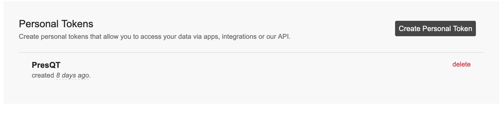

Authentication/Authorization
============================
PresQT will not have the ability to create a 'session' for the user based on authentication. It will 
be expecting tokens to be passed through the header of the request. When retrieving items it expects 
'presqt-source-token' to be in the header. When depositing an item it expects 'presqt-destination-token' 
to be in the header. 

Target Token Instructions
+++++++++++++++++++++++++

Open Science Framework
""""""""""""""""""""""
1. Navigate to |osf_link| and login to your account.

.. |osf_link| raw:: html

   <a href="https://osf.io/" target="_blank">https://osf.io/</a>

2. Upon logging in, click on your username in the top right corner and then click on ``Settings``.

3. Once in`` ``Settings``, click on ``Personal Access Tokens`` in the left hand menu.

4. Click on ``Create token``.

5. Create a token name and select all scope options. Then press ``Create token``.

6. Make sure you copy this token somewhere securely, this will be the only time it is shown to you.

CurateND
""""""""
1. Navigate to |curate_link| and login to your account.

.. |curate_link| raw:: html

   <a href="https://curate.nd.edu" target="_blank">https://curate.nd.edu</a>

2. In the top right corner, select ``Manage`` and then click on ``API Access Tokens``.

3. Click on ``Create New Token``.

4. Make sure you copy this token somewhere securely.

GitHub
""""""
1. Navigate to |github_link| and login to your account.

.. |github_link| raw:: html

   <a href="https://github.com" target="_blank">https://github.com</a>

2. In the top right corner, select your profile picture and then click on ``Settings``.

3. In the bottom left of your settings, select ``Developer Settings``.

4. On the left hand side of this screen, select ``Personal Access Tokens``.

5. Click on ``Generate New Token``.

.. figure::  images/qa/github/github_step_5.png
    :align:   center
    :scale: 40%

6. Add a note about what the token will be used for, and select all scopes. Then select ``Generate Token``.

7. Make sure you copy this token somewhere securely, this will be the only time it is shown to you.

Zenodo
""""""
1. Navigate to |zenodo_link| and login to your account.

.. |zenodo_link| raw:: html

   <a href="https://zenodo.org" target="_blank">https://zenodo.org</a>

2. In the top right corner, select your username and then click on ``Applications``.

3. In the ``Personal access tokens`` section, click on ``New token``.

4. Give the token a name and select all scopes, then click ``Create``.

5. Make sure you copy this token somewhere securely, this will be the only time it is shown to you.

GitLab
""""""
1. Navigate to |gitlab_link| and login to your account.

.. |gitlab_link| raw:: html

   <a href="https://gitlab.com" target="_blank">https://gitlab.com</a>

2. In the top right corner, select your username and then click on ``Settings``.

3. In the left hand menu, select ``Access Tokens``.

4. Give the token a name and select all scopes, then click ``Create personal access token``.

5. Make sure you copy this token somewhere securely, this will be the only time it is shown to you.

FigShare
""""""""
1. Navigate to |figshare_link| and login to your account.

.. |figshare_link| raw:: html

   <a href="https://figshare.com/account/login" target="_blank">https://figshare.com/account/login</a>

2. In the top right corner, select your username and then click on ``Applications``.

3. Scroll down to the bottom of the screen, and click ``Create Personal Token``.

4. Give the token a description (name), then click ``Save``.

5. Make sure you copy this token somewhere securely, this will be the only time it is shown to you.

.. toctree::
   :maxdepth: 3