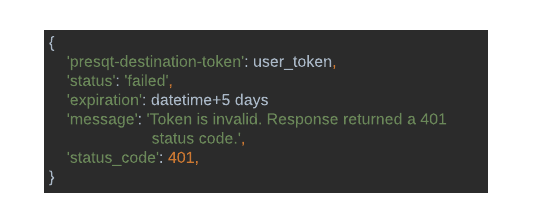
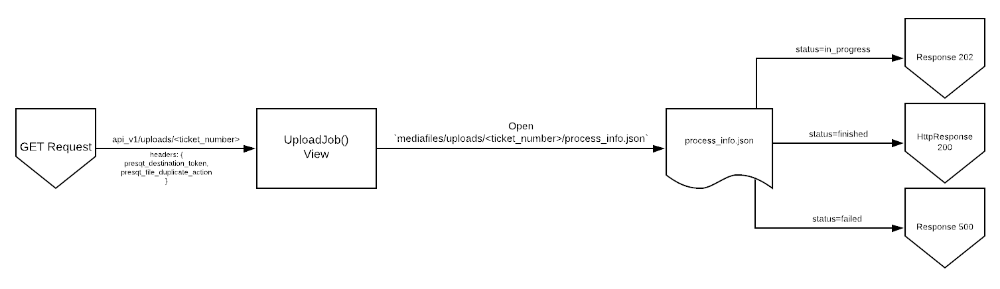
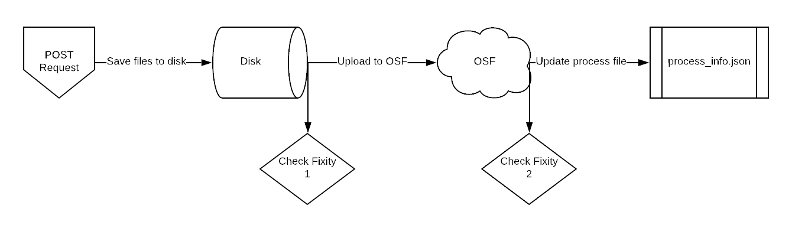

Code Documentation
==================

Target Endpoints
----------------

Target Details
++++++++++++++

Target JSON Values
++++++++++++++++++

JSON Validation
+++++++++++++++
We are using the JSON Schema library (https://json-schema.org/) to validated the Target JSON. 
Defining a JSON Schema for the Target JSON allows us to declare how the Target JSON should be structured. 
JSON Schema has a validation function where we can pass in a schema and JSON and it will return if 
the JSON is valid or not. The schema definition is located in ``/presqt/json_schemas/target_schema.json``.

**Validation Calls**

A management command has been written that will do Target JSON validation. It can be run manually by running:

``$ python manage.py validate_target_json``

This same management is called when ``docker-compose up`` is run. If the validation fails then it does 
not allow the docker containers to be spun up. 

Target API Endpoints
--------------------
PUT LINK HERE WHEN READY

Resources Endpoints
-------------------

Resource Collection Endpoint
++++++++++++++++++++++++++++

Resource Detail Endpoint
------------------------

Resource API Endpoints
----------------------
PLACE LINK HERE WHEN READY

Download Endpoints
------------------
To handle server timeouts, PresQT spawns any resource download off into a separate memory thread 
from the request memory. It creates a ticket number for a second endpoint to use to check in on the 
process. The full process can be seen in Image 1. Details of each process can be found below.

   Image 1: Full resource download process

Request Memory Process
++++++++++++++++++++++
The `/targets/<target_id>/resources/<resource_id>.zip/` GET endpoint prepares the disk for resource 
downloading by creating a ticket number (UUID) and writing a directory of the same name, 
`mediafiles/downloads/<ticket_number>`. In that directory, it creates a `process_info.json` file which 
will be the file that keeps track of the download process progress:

.. figure::  images/download_process/download_process2.png
   :align:   center

   Image 2: Initial state of process_info.json

The `process_info.json` file keeps track of various process data but its main use in this process is 
the 'status' key. It starts with a value of 'in_progress'. This is how we know the server is still 
processing the download request. So at this point we have a directory that looks like this:

* mediafiles
    * downloads
        * <ticket_number>
            * process_info.json

We then spawn the download process off into a different memory thread so it can be completed without 
a timeout sent back through the request. The spawned off function is _resource_download().  It then 
returns a 200 response with the ticket number in the payload back to the front end. The full request 
memory flow can be found below in Image 3.

.. figure::  images/download_process/download_process3.png
   :align:   center

   Image 3: Resource download preparation in request memory 

Server Memory Process
+++++++++++++++++++++
We now have the `_resource_download()` function running separately on the server. This function will 
go to the appropriate target download function and fetch the resources we want to download by 
fetching them from the target API. Once it has the resources it writes them into a new directory 
named `<target_name>_download_<resource_id>` located inside of `mediafiles/downloads/<ticket_number>`. 
While writing the resource we also run the resources through the fixity checker. Once all resources 
are written and their fixities checked we write the fixity information to a file called `fixity_info.json`. 
So if we are downloading from OSF, with a resource ID of 1234, and a ticket number of 9876 the 
directory would like the following:

* mediafiles
    * downloads
        * *process_info.json*
        * **osf_download_1234**
            * *file.jpg*
            * *fixity_info.json*

We then use BagIt to bag the data:

* mediafiles
    * downloads
        * *process_info.json*
        * **osf_download_1234**
            * **data**
                * *file.jpg*
                * *fixity_info.json*
            * *bag-info.txt*
            * *bagit.txt*

We then zip the data contents:

* mediafiles
    * downloads
        * *osf_download_1234.zip*
        * *process_info.json*
        * **osf_download_1234**
            * **data**
                * *file.jpg*
                * *fixity_info.json*
            * *bag-info.txt*
            * *bagit.txt*

We then update the `process_info.json` file to reflect that the download process is complete and the 
zip file is ready for download:

.. figure::  images/download_process/download_process4.png
   :align:   center

   Image 4: Final state of process_info.json after a successful download

If there was a failure while we downloaded the files from the target then none of the files get 
written to the disk and the `process_info.json` file gets updated to reflect the error. For instance, 
if a bad resource id was given:

.. figure::  images/download_process/download_process5.png
   :align:   center

   Image 5: Final state of process_info.json after a failed download

The full flow of the resource download in server memory can be found below in Image 6:

.. figure::  images/download_process/download_process6.png
   :align:   center

   Image 6: Prepare resource download process in server memory 

Download Job Check-In Endpoint
++++++++++++++++++++++++++++++
The `/download/<ticket_number>/` GET endpoint will check in on the download process on the server to 
see its status. It uses the ticket_number path parameter to find the `process_info.json` file in the 
corresponding folder, `mediafiles/downloads/<ticket_number>/process_info.json`.

* If the status is 'in_progress', it will return a 202 response along with a small payload.
* If the status is 'failed', it will return a 500 response along with the failure message and failure error code.
* If the status is 'finished', it will return a 200 response along with the zip file found in the same directory.

The full flow for this endpoint can be found on Image 7 below.

.. figure::  images/download_process/download_process7.png
   :align:   center

   Image 7: Resource download process check in 

Process Watchdog
++++++++++++++++
When downloading, a watchdog function is also spawned away from request memory. The purpose of it is 
to kill any processes that are taking too long. Right now, we say all downloaded processes have up 
to an hour to finish before the watchdog will kill the process. If this time limit is hit then after 
it kills the process the watchdog also updates the `process_info.json` file to the following:

.. figure::  images/download_process/download_process8.png
   :align:   center

   Image 8: Final state of process_info.json if the watchdog kills the process

Download Fixity
+++++++++++++++
The function ``download_fixity_checker(binary_file, hashes)`` takes in two required arguments, 
binary_file and hashes:

* **binary_file**: The file, in binary format, to run the hash algorithm on to check fixity.
* **hashes**: A dictionary of hashes provided by the target to compare to the hash calculated from the provided binary file. Example below:

   .. code-block:: json
    
    {
        "sha256": "343e249fdb0818a58edcc64663e1eb116843b4e1c4e74790ff331628593c02be",
        "md5": "a4536efb47b26eaf509edfdaca442037"
    }

The `download_fixity_checker` will loop through this `hashes` dictionary and when if finds a hashing 
algorithm that is supported by the python hashlib (https://docs.python.org/3/library/hashlib.html) 
then it will run that algorithm against the provided `binary_file`. If the provided hash and the 
calculated hash match then fixity passes!

If the `fixity_checker`  can't find a hashlib supported algorithm in `hashes` or if all the hash values 
in hashes are ``None`` then the `fixity_checker` will use `md5` as a default algorithm to still hash the 
file so we can pass that hash to the user. It also counts these situations as fixity passing since 
we didn't know what the original hash was. Below are examples.

   .. code-block:: json

    Valid Hashes Provided + Fixity Passes
    {
        "sha256": "343e249fdb0818a58edcc64663e1eb116843b4e1c4e74790ff331628593c02be",
        "md5": "a4536efb47b26eaf509edfdaca442037"
    }

    will yield

    {
        'hash_algorithm': sha256,
        'given_hash': 343e249fdb0818a58edcc64663e1eb116843b4e1c4e74790ff331628593c02be,
        'calculated_hash': 343e249fdb0818a58edcc64663e1eb116843b4e1c4e74790ff331628593c02be,
        'fixity': True
    }

   .. code-block:: json
    
    Valid Hashes Provided + Fixity Fails
    {
        "sha256": "343e249fdb0818a58edcc64663e1eb116843b4e1c4e74790ff331628593c02be",
        "md5": "a4536efb47b26eaf509edfdaca442037"
    }

    will yield

    {
        'hash_algorithm': sha256,
        'given_hash': 343e249fdb0818a58edcc64663e1eb116843b4e1c4e74790ff331628593c02be,
        'calculated_hash': 12345678,
        'fixity': False
    }

   .. code-block:: json

    Blank Hashes Provided
    {
        "sha256": None,
        "md5": None
    }

    will yield

    {
        'hash_algorithm': md5,
        'given_hash': None,
        'calculated_hash': 343e249fdb0818a58edcc64663e1eb116843b4e1c4e74790ff331628593c02be,
        'fixity': True
    }

   .. code-block:: json

    Unknown Hashes Provided
    {
        "unknown_hasher": None,
        "special_hasher": None
    }

    will yield

    {
        'hash_algorithm': md5,
        'given_hash': None,
        'calculated_hash': 343e249fdb0818a58edcc64663e1eb116843b4e1c4e74790ff331628593c02be,
        'fixity': True
    }

Download API Endpoints
----------------------
PUT LINKS HERE WHEN READY

Upload Endpoints
----------------

Multiple Upload Endpoints
+++++++++++++++++++++++++
Resources can be uploaded via two endpoints. To upload a new top level resource they use the 
`/targets/<target_id>/resources/` POST endpoint. To upload the resource to an existing container they 
use the `/targets/<target_id>/resources/<resource_id>/`  POST endpoint.

Overview
++++++++
To handle server timeouts, PresQT spawns any resource upload off into a separate memory thread from 
the request memory. It creates a ticket number for a second endpoint to use to check in on the process. 
The full process can be seen in `Image 1`. Details of each process can be found below.

.. figure::  images/upload_process/upload_process1.png
   :align:   center

   Image 1: Full resource upload process

Request Memory Process
++++++++++++++++++++++
The `/targets/<target_id>/resources/` and `/targets/<target_id>/resources/<resource_id>/`  endpoints 
prepare the disk for resource uploading by creating a ticket number (UUID) and writing a directory 
of the same name, `mediafiles/uploads/<ticket_number>`. It will then unzip the contents of the provided 
zip file into that directory. If the bag fails to validate after it has been written to the disk, then 
we will remove those files and attempt to write them again in case it was an IO error. If this write 
process fails 3 times, then the server returns an error. Also in the ticket_number directory, it 
creates a `process_info.json` file which will be the file that keeps track of the upload process progress:

   Image 2: Initial state of process_info.json

The `process_info.json` file keeps track of various process data but its main use in this process is 
the 'status' key. It starts with a value of 'in_progress'. This is how we know the server is still 
processing the upload request. So at this point we have a directory that looks like this:

* **mediafiles**
    * **uploads**
        * **<ticket_number>**
            * **zip_file_bag**
                * **data**
                    * **project_to_upload**
                        * **folder_to_upload**
                            * file_to_upload.txt
                * manifest-sha512.txt
                * bagit.txt
                * bag-info.txt
            * process_info.json

We know fixity has remained while saving these resources to disk because the bag has validated so 
now we need to make sure we have hashes using an algorithm that the Target will also use. If the 
Target supports an algorithm used in the bag we simply get those hashes from the bag otherwise we 
generate new hashes using a Target supported hashing algorithm. These hashes will be used to compare 
against the hashes given to us by the Target after upload.

Now that we have the files saved to disk and their hashes, we spawn the upload process off into a 
different memory thread so it can be completed without a timeout sent back through the request. The 
spawned off function is `_resource_upload()`.  It then returns a 200 response with the ticket number 
in the payload back to the front end. The full request memory flow can be found below in `Image 3`.

.. figure::  images/upload_process/upload_process3.png
   :align:   center

   Image 3: Resource upload in request memory thread

Server Memory Process
+++++++++++++++++++++
We now have the `_resource_upload()` function running separately on the server. This function will go 
to the appropriate target upload function and upload the resources using the target API. If all 
files are uploaded successfully, then the hashes brought back from the target are compared with the 
hashes we calculated earlier. Any files that failed fixity are kept track of in the key 'failed_fixity' 
in `process_info.json`. Duplicate files that were ignored and updated are also kept track of in 
`process_info.json`. The following are the possible states of process_info.json after uploading has 
completed:

   Image 4: process_info.json state after successful upload

.. figure::  images/upload_process/upload_process5.png
   :align:   center

   Image 5: process_info.json state when fixity fails with ignored/updated duplicates

   Image 6: process_info.json state when upload fails

The full flow of the resource upload in server memory can be found below in Image 7:

.. figure::  images/upload_process/upload_process7.png
   :align:   center

   Image 7: Prepare resource upload process in server memory  

Upload Job Check-In Endpoint
++++++++++++++++++++++++++++
The `/upload/<ticket_number>/` GET endpoint will check in on the upload process on the server to see 
its status. It uses the ticket_number path parameter to find the `process_info.json` file in the 
corresponding folder, `mediafiles/uploads/<ticket_number>/process_info.json`.

* If the status is 'in_progress', it will return a 202 response along with a small payload.
* If the status is 'failed', it will return a 500 response along with the failure message and failure error code.
* If the status is 'finished', it will return a 200 response along with a small payload.

The full flow for this endpoint can be found on Image 8 below:

   Image 8: Resource download process check in

Process Watchdog
++++++++++++++++
When uploading, a watchdog function is also spawned away from request memory. The purpose of it is 
to kill any processes that are taking too long. Right now, we say all upload processes have up to an 
hour to finish before the watchdog will kill the process. If this time limit is hit then after it 
kills the process the watchdog also updates the `process_info.json` file to the following:

   Image 9: process_info.json state if the watchdog kills the process

Upload API Endpoints
--------------------
ADD LINKS HERE

Upload Fixity
-------------
During the resource upload process, fixity is checked in two locations. First, when files are saved 
to the disk from the request. Second, after files are uploaded to the target. 

   Image 1: Where in the upload process fixity is checked

Fixity Check 1
++++++++++++++
Resources must be included in the POST request in BagIt format as a zip file. After unzipping the 
file and saving it to the server we validate the bag using BagIt's built in validator. If any files 
saved don't match the manifest originally given then the fixity has failed and the server will return 
an error.

Generate New Hashes If Necessary
++++++++++++++++++++++++++++++++
We now know that the currently saved files are the same as what the user sent forward. Before upload 
resources to the target we will make sure that there is a dictionary of hashes available that are 
supported by the target. If the target supports a hash algorithm provided by the resource's 'bag' 
then we will simply use those. If not, then we need to generate new hashes based on a target supported 
hash algorithm. 

Fixity Check 2
++++++++++++++
After resources are uploaded to the target, we compare the resources' hashes brought back from the 
target to the hashes we captured before. If any hashes don't match then fixity fails. Since the 
resources have already been uploaded we simply capture which resources' fixity fails and pass that 
along the response payload along with the message, 'Upload successful but fixity failed'.

Example BagIts
--------------

BagIt Zip files
+++++++++++++++
Since the upload endpoint requires a BagIt file in zip format here are some pre-made zip files to test the upload endpoint.

`#1 Valid BagIt For Top Level Container w/Folder <https://firebasestorage.googleapis.com/v0/b/gitbook-28427.appspot.com/o/assets%2F-LMcMJmToep43UCF_R1w%2F-Lny89QJzv_kKe7w9YRq%2F-LnyZSfPfwLQS09SPdAL%2FNewProjectWithFolderBagIt.zip?alt=media&token=6d710f6a-2353-4515-85e2-5cd21abc4afd />`_

`#2 Valid BagIt For Top Level Container w/File <https://firebasestorage.googleapis.com/v0/b/gitbook-28427.appspot.com/o/assets%2F-LMcMJmToep43UCF_R1w%2F-Lny89QJzv_kKe7w9YRq%2F-Lny_PcjK3_BrsGQQNPP%2FNewProjectWithSingleFileBagIt.zip?alt=media&token=9c2b10c1-54c3-40ff-a038-163fd55c424e />`_

`#3 Valid BagIt For Existing Container w/Single File <https://firebasestorage.googleapis.com/v0/b/gitbook-28427.appspot.com/o/assets%2F-LMcMJmToep43UCF_R1w%2F-Lny89QJzv_kKe7w9YRq%2F-Lny_XOAvH1FEg8rUmQC%2FSingleFileDuplicate.zip?alt=media&token=98b5952b-3a19-47c0-b7cf-d8950e866284 />`_

`#4 Valid BagIt For Existing Container w/Folders & Files <https://firebasestorage.googleapis.com/v0/b/gitbook-28427.appspot.com/o/assets%2F-LMcMJmToep43UCF_R1w%2F-Lny89QJzv_kKe7w9YRq%2F-Lny_uW8gKnKU-a_KfE5%2FExistingContainerBagIt.zip?alt=media&token=0afebebf-cbb5-4a7f-884c-6f82ab88e0a0 />`_

`#5 Invalid BagIt - Bad Manifest <https://firebasestorage.googleapis.com/v0/b/gitbook-28427.appspot.com/o/assets%2F-LMcMJmToep43UCF_R1w%2F-Lny89QJzv_kKe7w9YRq%2F-Lnya0HF9nI3DTZKlBKV%2FBadBagItManifest.zip?alt=media&token=4f08f6f9-f7e3-4fc5-b31e-46499b8cbbbf />`_

`#6 Invalid BagIt - Missing File <https://firebasestorage.googleapis.com/v0/b/gitbook-28427.appspot.com/o/assets%2F-LMcMJmToep43UCF_R1w%2F-Lny89QJzv_kKe7w9YRq%2F-Lnya82iBtV9Lb0DVFlN%2FBadBagItMissingFile.zip?alt=media&token=bececbbc-54ff-4992-834e-abbd9f034b83 />`_

`#7 Invalid BagIt - Unknown File <https://firebasestorage.googleapis.com/v0/b/gitbook-28427.appspot.com/o/assets%2F-LMcMJmToep43UCF_R1w%2F-Lny89QJzv_kKe7w9YRq%2F-LnyaFEGGL41khJyrPAE%2FBadBagItUnknownfile.zip?alt=media&token=730f335c-03c4-4507-8610-e185f9a45c4f />`_

Example Workflow
++++++++++++++++
The following are instructions on how the BagIt files above can be used to test the Upload endpoint:

1. Make a POST to ``https://localhost/api_v1/targets/osf/resources/`` with BagIt #2 to see a new top level container created.
2. Get the id of the new container and make a POST to ``https://localhost/api_v1/targets/osf/resources/{resource_id}/`` with BagIt #3 and with the 'presqt-file-duplicate-action' set to 'ignore' to see that the duplicate file is found and it's contents are different but the file is updated.
3. Make the same request as 2 but set the header 'presqt-file-duplicate-action' to 'update' to see the file updated.
4. With the same container id make a POST request to ``https://localhost/api_v1/targets/osf/resources/{resource_id}/`` with BagIt #4 to see new files and folders added to the top level container.
5. A POST request with BagIts 5-7 should return an error with nothing being uploaded.

Asynchronous Requests
---------------------
The Center for Research Computing has implemented asynchronous requests in its integration of OSF 
with PresQT.  They used the python library aiohttp (https://github.com/aio-libs/aiohttp) to accomplish 
this.

Example - OSF Resource Collection
+++++++++++++++++++++++++++++++++
When navigating the OSF API for endpoints such as Resource Collection they found that a massive 
amount of GET requests to OSF would occur. For instance, getting the resources for a fork of the 
PresQT project (https://osf.io/d3jx7/) took roughly 1 minute and after implementing asynchronous 
requests it now takes roughly 25 seconds.

Asynchronous requests allows us to group similar API requests together to be made at the same time 
rather than one at a time. Because of the nature of APIs and needing to hit an endpoint to see where 
to go further, not all requests could be grouped together so we devised a strategy to group as many 
as we could. The following image is our solution. Every color is a grouping of asynchronous requests:

.. figure::  images/asynchronous_requests/async_request_grouping.png
   :align:   center

   Image 1: Asynchronous Request Grouping

.. toctree::
   :maxdepth: 3