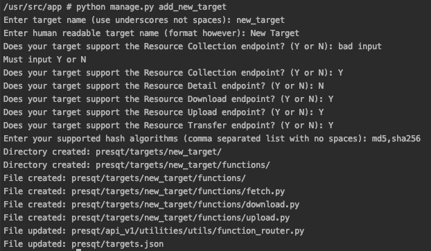

Integration Management Command
==============================
To make the process of new target integration easier, there is a Django management command that can 
be run to automate the integration process. It will update the necessary files and create directories 
and functions for you.

``python manage.py add_new_target`` will start the command. the command will ask a series of questions 
about the new target and then create/update files while giving a log of what was done.

   Example Screenshot of the integration command working

.. toctree::
   :maxdepth: 3