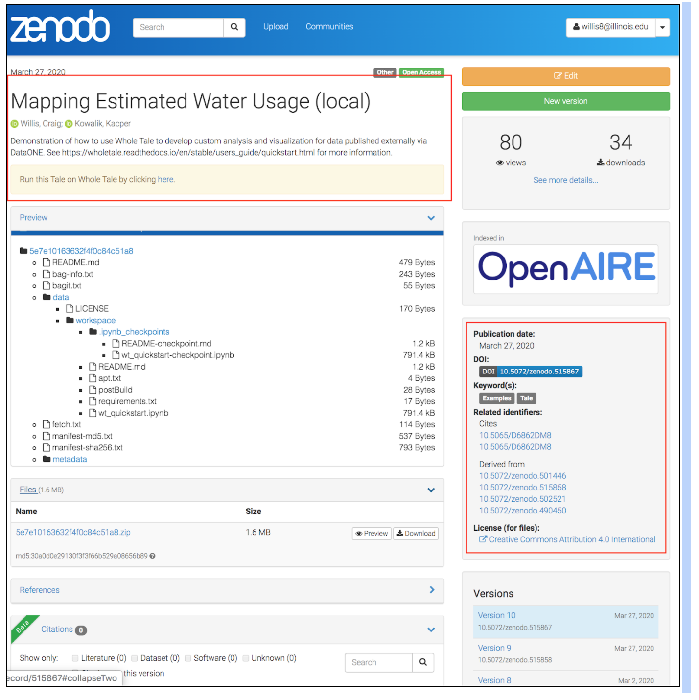
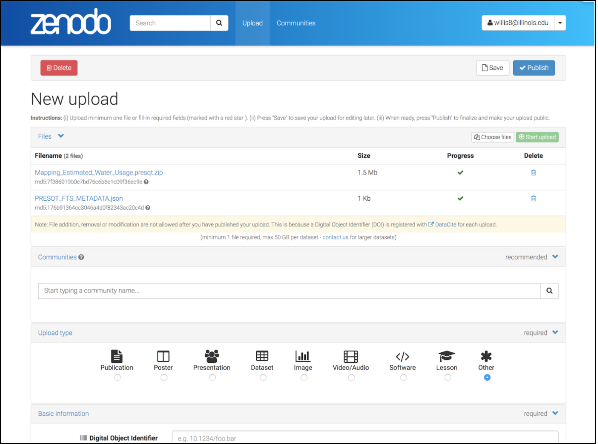

Other Integrations
==================

Whole Tale Integration Proposal
+++++++++++++++++++++++++++++++

Whole Tale (http://www.wholetale.org) is a platform for the creation, publication, and 
re-execution of reproducible computational artifacts.  Researchers can create new *tales* 
that contain the code, data, workflow, and information about the computational
environment required to reproduce their analysis. Tales have basic metadata
including authors, title, keywords, description, and related identifiers (cited
derived from). Tales can be published to archival repositories including DataONE 
network members and Zenodo. 

Whole Tale is an integration partner for the PresQT project.  As part of the
integration testing process, we explored two different use cases:

- Publish Tales from the WT platform to Zenodo and CurateND using the PresQT APIs
- Import an OSF project into WT using the PresQT APIs

**BagIt Serialization**

Tales are exported as BDBag-compatible bags with the following structure:

.. parsed-literal::

  5e696df5f1c291f11ae9e1a8/
    README.md               <-- Top-level readme (Tag file)
    bagit.txt
    bag-info.txt
    fetch.txt               <-- Fetch file
    manifest-md5.txt
    manifest-sha256.txt
    run-local.sh            <-- Script to run Tale locally (Tag file)
    tagmanifest-md5.txt
    tagmanifest-sha256.txt
    data/
      workspace/            <-- Tale workspace (user code, data, etc)
        environment.yml
        index.ipynb
      LICENSE               <-- Tale license (Tag file)
    metadata/               <-- Tale metadata (Tag directory)
        environment.json    
        manifest.json

The Tale bag is not currently compatible with PresQT, since PresQT currently
requires a single top-level folder in the payload representing the project.  The
folder name is used as the dataset title when publishing to a target.  Since the
Tale bag has a separate structure, one option is to double-bag. In the following
example, the above Tale is zipped and bagged:

.. parsed-literal::

  presqt_bag/
    bagit.txt
    bag-info.txt
    manifest-md5.txt
    manifest-sha256.txt
    tagmanifest-md5.txt
    tagmanifest-sha256.txt
    data/
      Mapping Estimated Water Usage/
        5e7e10163632f4f0c84c51a8.zip
 

**Publishing to Zenodo**

The following figures illustrate the Tale as published to Zenodo using the WT
internal integration and using PresQT.

The first images illustrates a tale published to Zenodo using the WT internal
integration.  The title, author, and description are all provided by the user
during tale creation.  The WT platform adds a note with a custom link allowing
the user to import and re-execute the tale in the WT system.  WT also supports
related identifiers, license, and keywork metadata. The tale is published as a
zipped bag.

   Tale published to Zenodo via WT

The second image illustrates a tale published to Zenodo using the PresQT
integration. The user is directed to the draft dataset creation form where they
are required to manually enter relevant metadata. 

   Tale published to Zenodo via PresQT

**Metadata Support**

To support our current Zenodo integration using the PresQT system would require
the ability to specify additional metadata during dataset creation. We use
the following fields:

- Title
- Creator/Authors (first name, last name, ORCID)
- Publication date/date
- Description
- Subject/keywords 
- Rights/license
- Related identifiers (Cites, Derived From)
- References
- Notes

The notes field is important as it provides a way for us to embed a link in the
record that allows users to easily re-import and run the published tale.

For more information, see https://github.com/whole-tale/serialization-format/

Whole Tale Integration Implementation
+++++++++++++++++++++++++++++++++++++
An 'extra_metadata' field has been added to the PRESQT_FTS_METADATA.json. To get these extra
metadata fields to the new resource being created, the uploaded resources must have a
PRESQT_FTS_METADATA.json file at the highest level.

The following is an example:

.. code-block:: json

    {
        "allKeywords": [],
        "actions": [],
        "extra_metadata": {
            "title": "str",
            "creators": [
                {
                    "first_name": "Example",
                    "last_name": "User",
                    "ORCID": "0931234123"
                }
            ],
            "publication_date": "2021-02-19",
            "description": "This is it.",
            "
            
            s": [],
            "license": "MIT",
            "related_identifiers": [],
            "references": "Nothing here.",
            "notes": "Nope."
        }
    }
