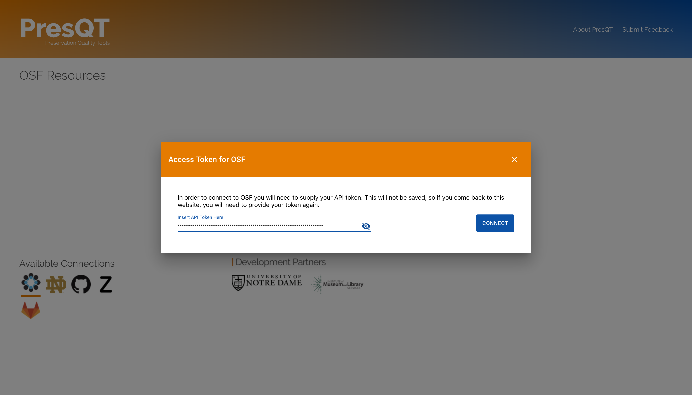
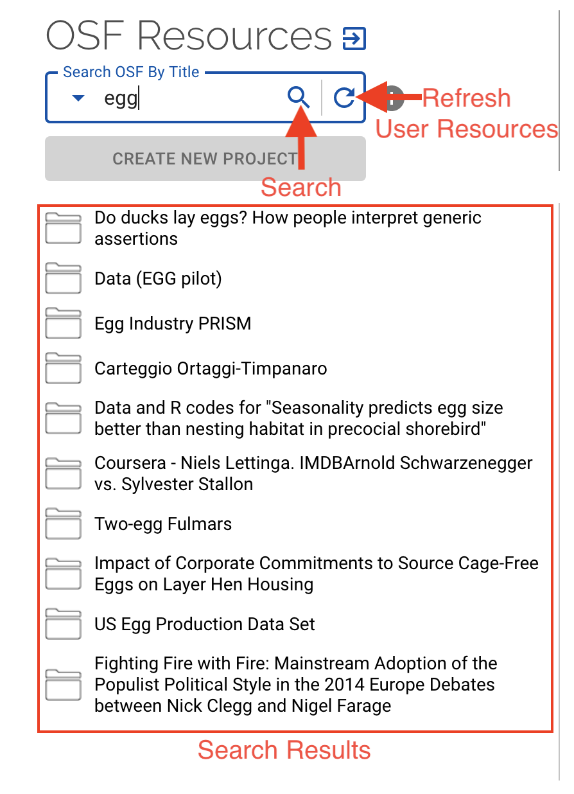
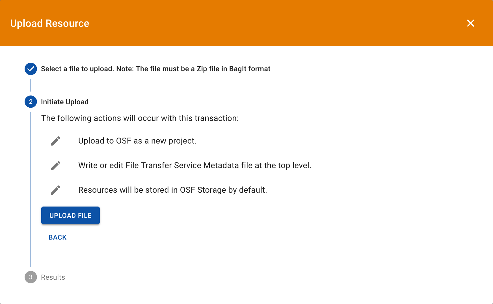
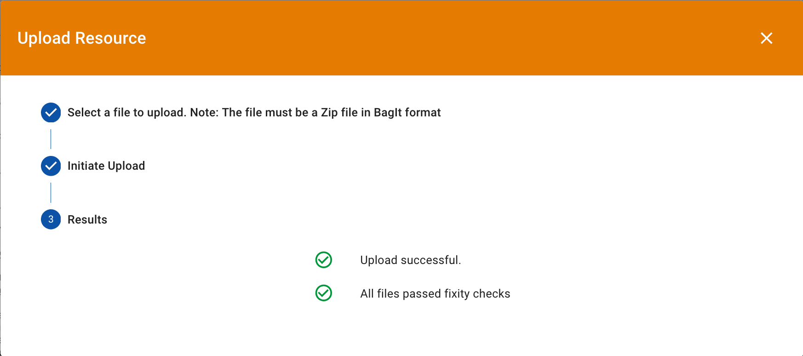
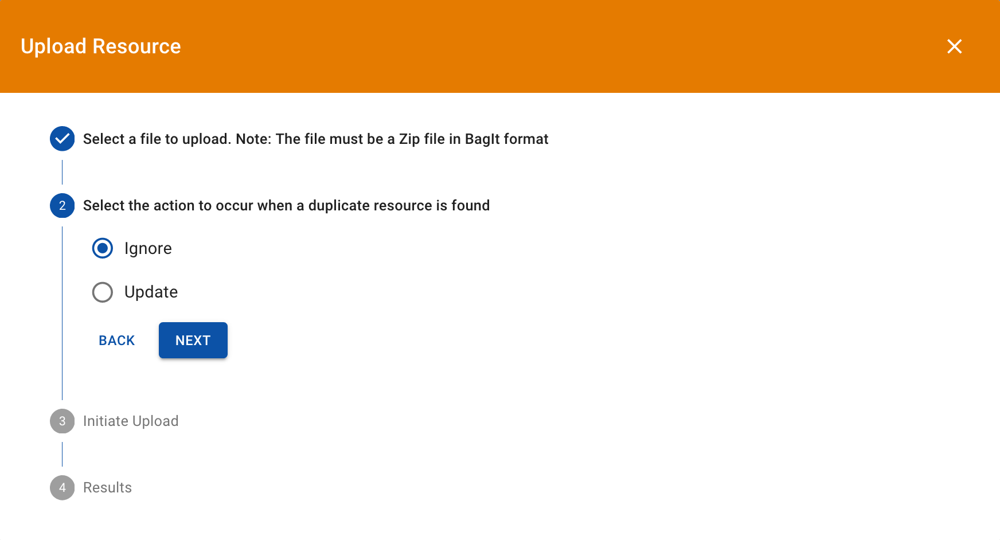
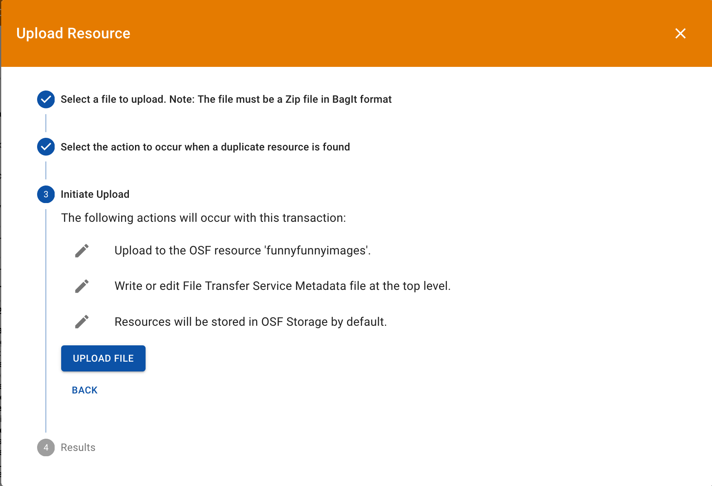
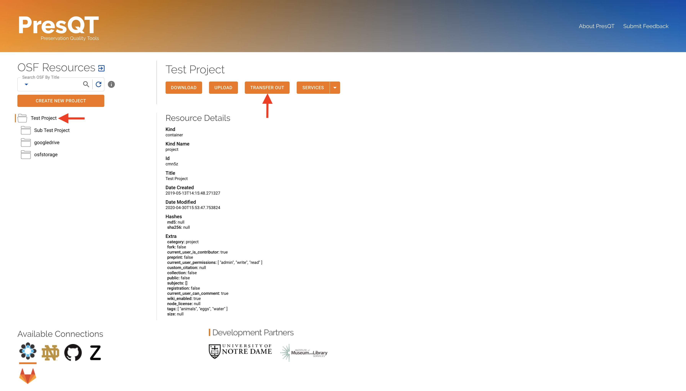
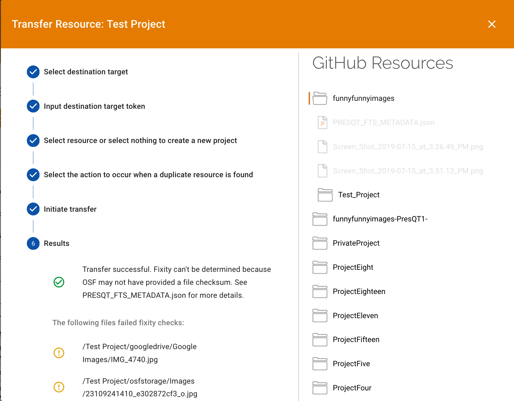
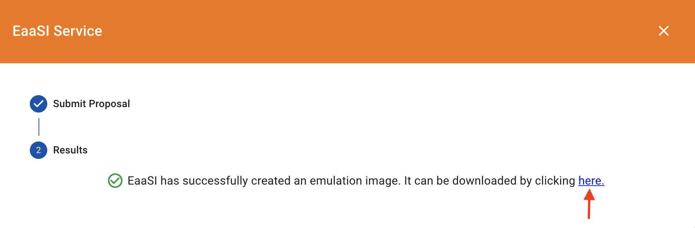
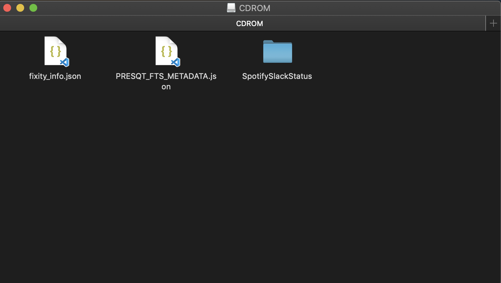

QA Testing
==========

Be sure to use the table of contents shown here to help navigate the instructions

|qa_location_link| to go to the testing site.

.. |qa_location_link| raw:: html

   <a href="https://presqt-prod.crc.nd.edu" target="_blank">Click here</a>

|training_link|

.. |training_link| raw:: html

   <a href="https://drive.google.com/drive/folders/1FxFYatauUq5swIlPHwm4hAnlSBB41c7u?usp=sharing" target="_blank">Demo Videos</a>

Resources
---------
We use the term ``resources`` for all content such as files, folders, projects, repos, items, etc.
It's a catch all term since different websites name their content differently.

BagIt Tool
----------
BagIt is a hierarchical filesystem format for storing and transferring digital content. PresQT
expects all files Uploaded to be zipped files in BagIt format. All downloads from PresQT come
in BagIt format as well. PresQT has a tool that will take a zipped file and return it to you
in BagIt format.

Getting Authorization Tokens From Partner Sites
-----------------------------------------------
An ``Authorization Token`` is a unique identifier for a user requesting access to a service.

You can |auth_location_link| for instructions on how to get authorization tokens for each target.

.. |auth_location_link| raw:: html

   <a href="https://presqt.readthedocs.io/en/latest/authentication_authorization.html#taget-token-instructions" target="_blank">click here</a>

Test Files
-----------------
Here are some pre-made ZIP files that are in BagIt format that can be downloaded for use with PresQT.

:download:`presqt_Images.zip <qa_bagits/presqt_Images.zip>`

:download:`presqt_MediaFiles.zip <qa_bagits/presqt_MediaFiles.zip>`

:download:`presqt_TextFiles.zip <qa_bagits/presqt_TextFiles.zip>`

:download:`presqt_MixedFileTypes.zip <qa_bagits/presqt_MixedFileTypes.zip>`

Known Bugs And Issues
---------------------
* None as of this writing

Testing Instructions
--------------------

Login To Targets From PresQT Demo UI
++++++++++++++++++++++++++++++++++++
1. Click on any Target icon under 'Available Connections' to pop open a login window.

.. figure:: images/qa/login/login_step_1.png
    :align: center

2. Copy your ``Authorization Token`` for the target and press ``Connect``

3. Resources associated with this token will appear on the left side.
4. You can log out of the target and use a different token by pressing the button next to the resources header.

.. figure:: images/qa/login/login_step_3.png
    :align: center

5. To log into a different target simply repeat the process with a different target icon.
Once logged in you can switch between targets without having to provide your key.

Navigate and Searching The Resource Collection
++++++++++++++++++++++++++++++++++++++++++++++
|qa_location_link| to go to the testing site.

.. |qa_location_link| raw:: html

   <a href="https://presqt-prod.crc.nd.edu" target="_blank">Click here</a>

|training_link|

.. |training_link| raw:: html

   <a href="https://drive.google.com/drive/folders/1FxFYatauUq5swIlPHwm4hAnlSBB41c7u?usp=sharing" target="_blank">Demo Videos</a>

1. After logging in you can navigate through your ``Resource Collection`` by clicking on the folders and files on the left.
2. Clicking on a resource shows you the ``Resource Details`` on the right.

.. figure:: images/qa/resource_collection/resource_collection_step_1.png
    :align: center

3. Searching for public resources can be accomplished by selecting a search type and then pressing
the ``search icon``. Public resources will be shown in the ``Resource Collection``.
4. You can get back to your resources by pressing the ``refresh button``.

Resource Details And Actions
++++++++++++++++++++++++++++
1. Once you click on a resource you will get its details and buttons for each action available
for this resource. If the button is disabled then that action isn't available for that resource.

.. figure:: images/qa/resource_detail/resource_detail_step_1.png
    :align: center

Resource Download
+++++++++++++++++
|qa_location_link| to go to the testing site.

.. |qa_location_link| raw:: html

   <a href="https://presqt-prod.crc.nd.edu" target="_blank">Click here</a>

|training_link|

.. |training_link| raw:: html

   <a href="https://drive.google.com/drive/folders/1FxFYatauUq5swIlPHwm4hAnlSBB41c7u?usp=sharing" target="_blank">Demo Videos</a>

1. To download a resource, first select the resource in the ``resource collection`` and then click
the ``Download`` action button in the details section.

.. figure:: images/qa/resource_download/download_step_1.png
    :align: center

2. A modal will pop open providing you with transaction details. Click on the ``Download`` button
to start the download.

.. figure:: images/qa/resource_download/download_step_2.png
    :align: center

3. Once the download is complete, the modal will provide you with details about how the download
process went.

.. figure:: images/qa/resource_download/download_step_3.png
    :align: center

4. All downloads come in ``BagIt format``. After the download is complete, unzip the file,
and you will see BagIt specification files. The data you requested to download will reside in
the ``data`` folder.

.. figure:: images/qa/resource_download/download_step_4.png
    :align: center
    :scale: 50%

Resource Upload
+++++++++++++++
|qa_location_link| to go to the testing site.

.. |qa_location_link| raw:: html

   <a href="https://presqt-prod.crc.nd.edu" target="_blank">Click here</a>

|training_link|

.. |training_link| raw:: html

   <a href="https://drive.google.com/drive/folders/1FxFYatauUq5swIlPHwm4hAnlSBB41c7u?usp=sharing" target="_blank">Demo Videos</a>

Upload As A New Project
+++++++++++++++++++++++
1. To upload to the target as a new project click the ``Create New Project`` button above the
``resource collection``.

.. figure:: images/qa/resource_upload/upload_new_step_1.png
    :align: center

2. A modal will pop open with an ``upload stepper``. First select the file you'd like to upload.
The file must be a zip file who's contents are in valid BagIt format.

.. figure:: images/qa/resource_upload/upload_new_step_2.png
    :align: center
    :scale: 30%

3. Next, the modal will display transaction details. Click ``Upload File`` to begin the upload process.

4. Once the upload is completed, the modal will provide you with details about how the upload
process went.

5. You should also see the new uploaded resources appear in the ``resource collection``.

Upload To An Existing Resource
++++++++++++++++++++++++++++++
1. To upload a resource, first select the resource in the ``resource collection`` and then click
the ``Upload`` action button in the details section.

.. figure:: images/qa/resource_upload/upload_existing_step_1.png
    :align: center

2. A modal will pop open with an ``upload stepper``. First select the file you'd like to upload.
The file must be a zip file who's contents are in valid BagIt format.

.. figure:: images/qa/resource_upload/upload_existing_step_2.png
    :align: center
    :scale: 30%

3. Select how you want PresQT to handle any duplicate files it finds existing in the resource already.
``Ignore`` will simply ignore the duplicate. ``Update`` will update the existing file with the new
uploaded file's contents if they differ.

4. Next, the modal will display transaction details. Click ``Upload File`` to begin the upload process.

5. Once the upload is completed, the modal will provide you with details about how the upload
process went.

.. figure:: images/qa/resource_upload/upload_existing_step_5.png
    :align: center
    :scale: 30%

6. You should also see the new uploaded resources appear in the ``resource collection``.

Resource Transfer
+++++++++++++++++
|qa_location_link| to go to the testing site.

.. |qa_location_link| raw:: html

   <a href="https://presqt-prod.crc.nd.edu" target="_blank">Click here</a>

|training_link|

.. |training_link| raw:: html

   <a href="https://drive.google.com/drive/folders/1FxFYatauUq5swIlPHwm4hAnlSBB41c7u?usp=sharing" target="_blank">Demo Videos</a>

1. To transfer a resource to another target, first select the resource in the ``resource collection``
and then click the ``Transfer`` button in the details section.

2. A modal will pop open with a ``transfer stepper``. First, select the target you want to ``transfer to`` and press the ``Next`` button.

.. figure:: images/qa/resource_transfer/transfer_step_2.png
    :align: center
    :scale: 30%

3. Input your token for the target you selected and press the ``Next`` button.

.. figure:: images/qa/resource_transfer/transfer_step_3.png
    :align: center
    :scale: 30%

4. Select the resource you want to transfer to. Don't select any resource if you want to create
a new project. Press ``Next`` once you have made your selection.

.. figure:: images/qa/resource_transfer/transfer_step_4.png
    :align: center
    :scale: 30%

5. Select how you want PresQT to handle any duplicate files it finds existing in the resource already.
``Ignore`` will simply ignore the duplicate. ``Update`` will update the existing file with the new
transferred file's contents if they differ. Press the ``Next`` button once you've made your selection.
If you are making a new project then just press ``Next``.

.. figure:: images/qa/resource_transfer/transfer_step_5.png
    :align: center
    :scale: 30%

6. Next, the modal will display transaction details. Click ``Transfer File`` to begin the transfer process.

.. figure:: images/qa/resource_transfer/transfer_step_6.png
    :align: center
    :scale: 30%

7. Once the transfer is completed, the modal will provide you with details about how the transfer
process went.

8. You should also see the new transferred resources appear in the modal's ``resource collection`` on the right.

Verifying Fixity
----------------
``Fixity`` means the assurance that a digital file has remained unchanged. We determine file fixity
at every step along PresQT actions. More details about how PresQT handles fixity can be found
`Here <https://presqt.readthedocs.io/en/latest/web_services.html#fixity>`_.

Download
++++++++
All downloads come with a file with detailed fixity information named ``fixity_info.json``.
This file has an entry for every file involved in the download including each file's checksum hash
at the Source Target and the hash calculated on the PresQT servers before sent to the browser
for download. To verify fixity remains, the user must calculate the files' hashes on their local
machine and compare it to the hashes provided.

Upload
++++++
Fixity during upload can be determined by inspecting the ``PRESQT_FTS_METADATA.json`` file
included with every upload. The attribute ``failedFixityInfo`` in this file will contain the
details if the file being uploaded has failed fixity.

Transfer
++++++++
Fixity during ``Transfer`` can be determined the same as ``Upload`` by inspecting the
``PRESQT_FTS_METADATA.json`` file in the destination target.

Verifying Keyword Enhancement
-----------------------------
See `Here <https://presqt.readthedocs.io/en/latest/web_services.html#keyword-assignment>`_ for
Keyword Enhancement details.

Keyword Enhancement As A Service
++++++++++++++++++++++++++++++++
Keyword Enhancement as a service will write a new entry to the ``PRESQT_FTS_METADATA.json`` file
in the target.  The action entry for keyword enhancement will say exactly which keywords were
added during this enhancement.

Keyword Enhancement During Transfer
+++++++++++++++++++++++++++++++++++
Keyword Enhancement during a transfer will work similarly to ``Keyword Enhancement As A Service``.
The difference is, for the destination target, the details of keyword enhancement will be located
in the transfer action entry instead of there being a new action entry for keyword enhancement.

Services
--------
|qa_location_link| to go to the testing site.

.. |qa_location_link| raw:: html

   <a href="https://presqt-prod.crc.nd.edu" target="_blank">Click here</a>

|training_link|

.. |training_link| raw:: html

   <a href="https://drive.google.com/drive/folders/1FxFYatauUq5swIlPHwm4hAnlSBB41c7u?usp=sharing" target="_blank">Demo Videos</a>

Send a Proposal to EaaSI
++++++++++++++++++++++++
1. To send a resource to EaaSI, first select the resource in the ``resource collection`` and then click
the ``Services`` action button in the details section. A drop down menu will appear from where you can select
``EaaSI``.

2. A modal will pop open with an ``EaaSI stepper``. First read the proposal and ensure the information is correct.
Once you have verified that this is what you'd like to do, press the ``Send`` button.

3. A spinner will keep you informed of where in the process the request is, whether that be on the
PresQT server or on EaaSI's.

4. Once the upload is completed, the modal will provide you with details about how the process went.
There will also be a link for you to download the EaaSI created image.

5. You can now open the image and run it however you please. Note: At this point in time, EaaSI's
server is only returning cd-rom images for us during testing. The environments will be changed to accurately
take into account the files contained within the project as development continues.

FAIRshare Evaluator Service
+++++++++++++++++++++++++++
1. To initiate a FAIRshare evaluation, first select the resource in the ``resource collection`` and then click
the ``Services`` action button in the details section. A drop down menu will appear from where you can select
``FAIRshare``.

2. A modal will pop open with a ``FAIRshare Evaluator Service stepper``. First read the information and ensure the information is correct.
Once you have verified that this is what you'd like to do, select the tests you would like to run.

3. Once you have selected the tests you'd like to run, you can choose to opt in for email notifications. When you are ready to run the
tests, press the ``Evaluate`` button.

4. A spinner will let you know that FAIRshare is processing the request. This may take awhile.

5. Once the process is complete, the results will be displayed in a drop down format to be reviewed.

