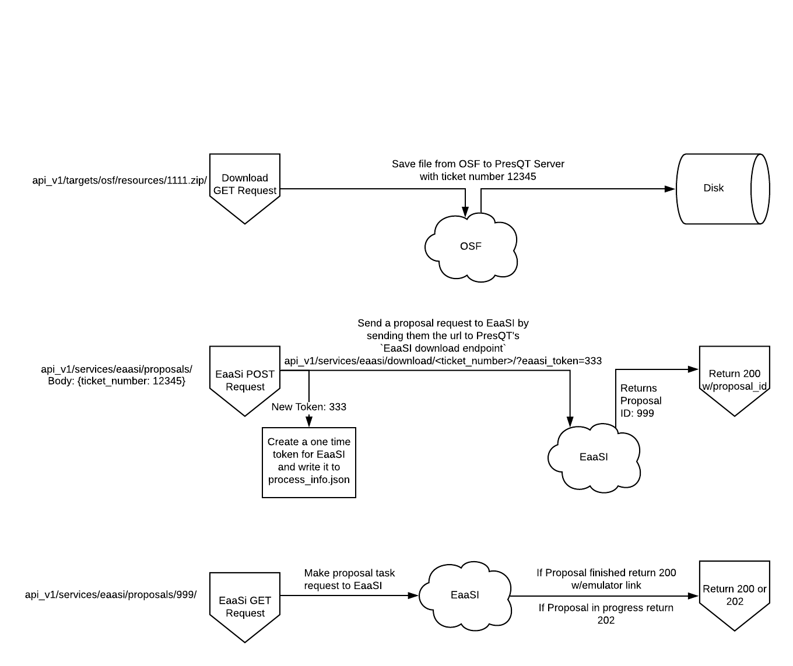

Services
========

A service is a unique target integration that is not accessible via the normal API endpoints.
Typically, the point of a service is to take action on a resource (emulate, annotate, etc.)
rather than simply storing it.

EaaSI (Emulation-as-a-Service Infrastructure) Service
-----------------------------------------------------
PresQT takes advantage of `EaaSI's <https://www.softwarepreservationnetwork.org/eaasi/ />`_
ability to interpret resources and suggest a relevant emulation environment. Our PresQT API calls
use `EaaSI's Proposal API <https://openslx.gitlab.io/eaas-api-docs/environment-proposer/environment-proposer/resource_EnvironmentProposerAPI.html>`_ to send resources to EaaSI.

Step 1: Download the Resource
+++++++++++++++++++++++++++++
PresQT is able to use the existing
`download endpoint <https://presqt.readthedocs.io/en/latest/api_endpoints.html#resource-download-endpoints>`_
to fetch a Target's resource to a PresQT server.

Step 2: Start a proposal task on an EaaSI server
++++++++++++++++++++++++++++++++++++++++++++++++
Then, using the ticket number created from the
PresQT download task, a
`POST request <https://presqt.readthedocs.io/en/latest/service_endpoints.html#submit-eaasi-proposal>`_
can be made to PresQT to send EaaSI a url where the downloaded resource can be fetched.
During this POST request we write a one time use token to the downloaded resource's process_info.json file.
The URL we send to EaaSI to fetch the PresQT resource has a query parameter with this token.
This `EaaSI download endpoint <https://presqt.readthedocs.io/en/latest/service_endpoints.html#eaasi-download>`_ is for EaaSI use only.

Step 3: Get proposal status from EaaSI
++++++++++++++++++++++++++++++++++++++
We then have a `GET endpoint <https://presqt.readthedocs.io/en/latest/service_endpoints.html#get-eaasi-proposal>`_ that
makes a request to EaaSI to find the progress of the Proposal Task. If the task is complete then we
return the url for the suggested emulation environment. Otherwise, we return a 202 status and let the
user know the proposal task is still in progress.

   Image 1: Workflow of getting an EaaSI Emulation Environment of a given resource

FAIR Evaluator Service
---------------------------
PresQT takes advantage of `FAIRshare's <https://fairsharing.github.io/FAIR-Evaluator-FrontEnd/#!/#%2F! />`_
prebuilt maturity indicator tests. Our PresQT API calls use an approved `collection of tests <https://fairsharing.github.io/FAIR-Evaluator-FrontEnd/#!/collections/16 />`_ identified by the
PI's and community.

FAIRshake Assessment Service
----------------------------
PresQT takes advantage of `FAIRshake's <https://fairshake.cloud/ />`_ manual assessment functionality
to allow users to assess the FAIRness of their research projects.
