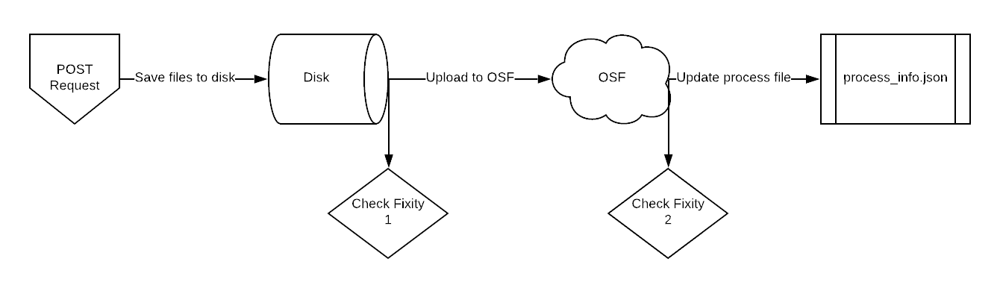

Web Services
============

Fixity
------

Tools
+++++

* Python Hashlib Library https://docs.python.org/3/library/hashlib.html
* BagIt Python Validation https://github.com/LibraryOfCongress/bagit-python#validation

PresQT Supported Hash Algorithms
++++++++++++++++++++++++++++++++

The following is a master list of hash algorithms that are both supported by a target and supported
by Python's HashLib library:

* sha256
* md5

Each individual target's supported hash algorithms can be found in presqt/targets.json

Resource Download Fixity
++++++++++++++++++++++++

Fixity is checked during ``Resource Download`` by comparing the file hashes provided by the source target
with hashes that are generated after files are downloaded on to the server. If the provided hash and the
calculated hash match then fixity passes!

The download function will try and find a matching hash algorithm between the source target supported algorithms and
algorithms supported by the Python Hashlib library to use when generating hashes for files downloaded to the server.
If no hash algorithms match or if the source target does not provide file hashes then ``md5`` is uses as a default.
It also counts this situation as fixity passing since we didn't know what the original hash was.

**Valid Hashes Provided + Fixity Passes Example**:

.. code-block:: json

    {
        "sha256": "343e249fdb0818a58edcc64663e1eb116843b4e1c4e74790ff331628593c02be",
        "md5": "a4536efb47b26eaf509edfdaca442037"
    }

    will yield

    {
        'hash_algorithm': sha256,
        'given_hash': 343e249fdb0818a58edcc64663e1eb116843b4e1c4e74790ff331628593c02be,
        'calculated_hash': 343e249fdb0818a58edcc64663e1eb116843b4e1c4e74790ff331628593c02be,
        'fixity': True
    }

**Valid Hashes Provided + Fixity Fails Example**:

.. code-block:: json

    {
        "sha256": "343e249fdb0818a58edcc64663e1eb116843b4e1c4e74790ff331628593c02be",
        "md5": "a4536efb47b26eaf509edfdaca442037"
    }

    will yield

    {
        'hash_algorithm': sha256,
        'given_hash': 343e249fdb0818a58edcc64663e1eb116843b4e1c4e74790ff331628593c02be,
        'calculated_hash': 12345678,
        'fixity': False
    }

**Blank Hashes Provided Example**:

.. code-block:: json

    {
        "sha256": None,
        "md5": None
    }

    will yield

    {
        'hash_algorithm': md5,
        'given_hash': None,
        'calculated_hash': 343e249fdb0818a58edcc64663e1eb116843b4e1c4e74790ff331628593c02be,
        'fixity': True
    }

**Unknown Hashes Provided Example**:

.. code-block:: json

    {
        "unknown_hasher": 12345,
        "special_hasher": 1234567
    }

    will yield

    {
        'hash_algorithm': md5,
        'given_hash': None,
        'calculated_hash': 343e249fdb0818a58edcc64663e1eb116843b4e1c4e74790ff331628593c02be,
        'fixity': True
    }

Resource Upload Fixity
++++++++++++++++++++++

During the resource upload process, fixity is checked in two locations. First, when files are saved
to the disk from the request. Second, after files are uploaded to the target.

   Image 1: Where in the upload process fixity is checked

Fixity Check 1
""""""""""""""
Resources must be included in the POST request in BagIt format as a zip file. After unzipping the
file and saving it to the server we validate the bag using BagIt's built in validator. If any files
saved don't match the manifest originally given then the fixity has failed and the server will return
an error.

Generate New Hashes If Necessary
""""""""""""""""""""""""""""""""
We now know that the currently saved files are the same as what the user sent forward. Before uploading
resources to the target we will make sure that there is a dictionary of hashes available generated by a hash algorithm
supported by the target. If the target supports a hash algorithm provided by the resource's 'bag'
then we will simply use those. If not, then we need to generate new hashes based on a target supported
hash algorithm.

Fixity Check 2
""""""""""""""
After resources are uploaded to the target, we compare the resources' hashes brought back from the
target to the hashes we captured before. If any hashes don't match then fixity fails. Since the
resources have already been uploaded we simply capture which resources' fixity fails and pass that
along the response payload along with the message, 'Upload successful but fixity failed'.

Resource Transfer Fixity
++++++++++++++++++++++++

Since the ``Transfer`` endpoint takes advantage of the ``Download`` and ``Upload`` endpoints, fixity
is checked using all methods already existing in those endpoints.

File Transfer Service (FTS) Metadata
------------------------------------
PresQT keeps track of file history of resources being updated by PresQT by passing along an
FTS Metadata file with each PresQT action. The file is titled ``PRESQT_FTS_METADATA.json``.
Every time PresQT takes action on a resource, the source details about the files moved are written
to the metadata file.

**Definition of** ``PresQT FTS Metadata`` **fields**:

===================== ====== ==============================================================================
actions               array  Array of PresQT actions that have taken place on the this project
id                    string ID of the PresQT action (uuid4). Created at the time metadata is written
actionDateTime        string Date and time that the action took place
actionType            string Type of action (Download, Upload, Transfer)
sourceTargetName      string Name of the source target the action is taking place on
sourceUsername        string Requesting user’s source target username
destinationTargetName string Name of the destination target the action is taking place on
destinationUsername   string Requesting user’s destination target username
files                 array  Array of files that were involved in the PresQT action
sourcePath            string Path of the file at the source target
sourceHashes          dict   Object that contains the file hashes at the source target
title                 string Title of the file at the source target
extra                 dict   Object that contains all extra metadata we can retrieve from the source target
failedFixityInfo      array  Array containing dictionaries of info on files that failed fixity check

                             `*` Fields found in these dictionaries

newGeneratedHash*     string PresQT generated hash of the file
algorithmUsed*        string Hash Algorithm used for the newGeneratedHash
reasonFixityFailed*   string Reason fixity failed for the file
destinationPath       string Path of the file at the destination target
destinationHashes     dict   Object that contains the file hashes at the destination target
===================== ====== ==============================================================================

**Example of** ``PresQT FTS Metadata`` **generated by a transfer of a project from GitHub to OSF**:

.. code-block:: json

    {
        "actions": [
            {
                "id": "bc5a48dc-d1f9-46bd-9137-48fe4843df77",
                "actionDateTime": "2019-11-12 15:45:45.309566+00:00",
                "actionType": "resource_transfer_in",
                "sourceTargetName": "github",
                "sourceUsername": "github_username",
                "destinationTargetName": "osf",
                "destinationUsername": "osf_username",
                "files": {
                    "created": [
                        {
                            "destinationPath": "NewProject/osfstorage/funnyfunnyimages/Screen_Shot.png",
                            "destinationHashes": {
                                "md5": "3505a89c3cbb82873a107ae41f3997c3"
                            },
                            "failedFixityInfo": [
                                {
                                    "NewGeneratedHash": "3505a89c3cbb82873a107ae41f3997c3",
                                    "algorithmUsed": "md5",
                                    "reasonFixityFailed": "Either a Source Hash was not provided or the source hash algorithm is not supported."
                                }
                            ],
                            "title": "Screen_Shot_2019-07-15_at_3.26.49_PM.png",
                            "sourceHashes": {},
                            "sourcePath": "/NewProject/funnyfunnyimages/Screen_Shot_2019-07-15_at_3.26.49_PM.png",
                            "extra": {
                                "commit_hash": "211ef8db83612802aeea151a0e04badfe287bcb9",
                                "size": 731202,
                                "url": "https://api.github.com/repos/presqt-test-user/NewProject/contents/funnyfunnyimages/Screen_Shot_2019-07-15_at_3.26.49_PM.png?ref=master",
                                "html_url": "https://github.com/presqt-test-user/NewProject/blob/master/funnyfunnyimages/Screen_Shot_2019-07-15_at_3.26.49_PM.png",
                                "git_url": "https://api.github.com/repos/presqt-test-user/NewProject/git/blobs/211ef8db83612802aeea151a0e04badfe287bcb9",
                                "download_url": "https://raw.githubusercontent.com/presqt-test-user/NewProject/master/funnyfunnyimages/Screen_Shot_2019-07-15_at_3.26.49_PM.png",
                                "type": "file",
                                "_links": {
                                    "self": "https://api.github.com/repos/presqt-test-user/NewProject/contents/funnyfunnyimages/Screen_Shot_2019-07-15_at_3.26.49_PM.png?ref=master",
                                    "git": "https://api.github.com/repos/presqt-test-user/NewProject/git/blobs/211ef8db83612802aeea151a0e04badfe287bcb9",
                                    "html": "https://github.com/presqt-test-user/NewProject/blob/master/funnyfunnyimages/Screen_Shot_2019-07-15_at_3.26.49_PM.png"
                                }
                            }
                        }
                    ],
                    "updated": [],
                    "ignored": []
                }
            }
        ]
    }

**Now if we download from OSF the same project that was just transferred, then** ``PresQT FTS Metadata`` **would be**:

.. code-block:: json

    {
        "actions": [
            {
                "id": "bc5a48dc-d1f9-46bd-9137-48fe4843df77",
                "actionDateTime": "2019-11-12 15:45:45.309566+00:00",
                "actionType": "resource_transfer_in",
                "sourceTargetName": "github",
                "sourceUsername": "github_username",
                "destinationTargetName": "osf",
                "destinationUsername": "osf_username",
                "files": {
                    "created": [
                        {
                            "destinationPath": "NewProject/osfstorage/funnyfunnyimages/Screen_Shot.png",
                            "destinationHashes": {
                                "md5": "3505a89c3cbb82873a107ae41f3997c3"
                            },
                            "failedFixityInfo": [
                                {
                                    "NewGeneratedHash": "3505a89c3cbb82873a107ae41f3997c3",
                                    "algorithmUsed": "md5",
                                    "reasonFixityFailed": "Either a Source Hash was not provided or the source hash algorithm is not supported."
                                }
                            ],
                            "title": "Screen_Shot_2019-07-15_at_3.26.49_PM.png",
                            "sourceHashes": {},
                            "sourcePath": "/NewProject/funnyfunnyimages/Screen_Shot_2019-07-15_at_3.26.49_PM.png",
                            "extra": {
                                "commit_hash": "211ef8db83612802aeea151a0e04badfe287bcb9",
                                "size": 731202,
                                "url": "https://api.github.com/repos/presqt-test-user/NewProject/contents/funnyfunnyimages/Screen_Shot_2019-07-15_at_3.26.49_PM.png?ref=master",
                                "html_url": "https://github.com/presqt-test-user/NewProject/blob/master/funnyfunnyimages/Screen_Shot_2019-07-15_at_3.26.49_PM.png",
                                "git_url": "https://api.github.com/repos/presqt-test-user/NewProject/git/blobs/211ef8db83612802aeea151a0e04badfe287bcb9",
                                "download_url": "https://raw.githubusercontent.com/presqt-test-user/NewProject/master/funnyfunnyimages/Screen_Shot_2019-07-15_at_3.26.49_PM.png",
                                "type": "file",
                                "_links": {
                                    "self": "https://api.github.com/repos/presqt-test-user/NewProject/contents/funnyfunnyimages/Screen_Shot_2019-07-15_at_3.26.49_PM.png?ref=master",
                                    "git": "https://api.github.com/repos/presqt-test-user/NewProject/git/blobs/211ef8db83612802aeea151a0e04badfe287bcb9",
                                    "html": "https://github.com/presqt-test-user/NewProject/blob/master/funnyfunnyimages/Screen_Shot_2019-07-15_at_3.26.49_PM.png"
                                }
                            }
                        }
                    ],
                    "updated": [],
                    "ignored": []
                }
            },
            {
                "id": "bc5a48dc-d1f9-46bd-9137-48fe4843df77",
                "actionDateTime": "2019-11-12 15:45:45.309566+00:00",
                "actionType": "resource_download",
                "sourceTargetName": "osf",
                "sourceUsername": "osf_username",
                "destinationTargetName": "Local Machine",
                "destinationUsername": None,
                "files": {
                    "created": [
                        {
                            "destinationPath": "/NewProject/osfstorage/funnyfunnyimages/Screen_Shot.png",
                            "destinationHashes": {},
                            "failedFixityInfo": [],
                            "title": "Screen_Shot_2019-07-15_at_3.26.49_PM.png",
                            "sourceHashes": {
                                "sha256": "6d33275234b28d77348e4e1049f58b95a485a7a441684a9eb9175d01c7f141ea",
                                "md5": "3505a89c3cbb82873a107ae41f3997c3"
                            },
                            "sourcePath": "/NewProject/osfstorage/funnyfunnyimages/Screen_Shot_2019-07-15_at_3.26.49_PM.png",
                            "extra": {
                                "id": "5dcc215848a1d9000cd0a3fb",
                                "parent_project_id": "2bw9j",
                                "endpoint": "https://api.osf.io/v2/files/5dcc215848a1d9000cd0a3fb/",
                                "download_url": "https://files.osf.io/v1/resources/2bw9j/providers/osfstorage/5dcc215848a1d9000cd0a3fb",
                                "upload_url": "https://files.osf.io/v1/resources/2bw9j/providers/osfstorage/5dcc215848a1d9000cd0a3fb",
                                "delete_url": "https://files.osf.io/v1/resources/2bw9j/providers/osfstorage/5dcc215848a1d9000cd0a3fb",
                                "last_touched": null,
                                "date_modified": "2019-11-13T15:29:29.043502Z",
                                "current_version": 1,
                                "date_created": "2019-11-13T15:29:29.043502Z",
                                "provider": "osfstorage",
                                "path": "/5dcc215848a1d9000cd0a3fb",
                                "current_user_can_comment": true,
                                "guid": null,
                                "checkout": null,
                                "tags": [],
                                "size": 731202
                            }
                        }
                    ],
                    "updated": [],
                    "ignored": []
                }
            }
        ]
    }

Metadata Location When Downloading
++++++++++++++++++++++++++++++++++

The ``PresQT FTS Metadata`` file will be written to the highest level possible of the resource
being downloaded.

Metadata Location When Uploading or Transferring
++++++++++++++++++++++++++++++++++++++++++++++++

The ``PresQT FTS Metadata`` file will be written to the highest level possible of the destination project.
Since this possible level may vary for any target, we leave it up to the target to handle this
when they integrate with Upload.

Existing Metadata
+++++++++++++++++

If a valid ``PresQT FTS Metadata`` file is found at the top level of the resource being affected by
the action then we will add a new action to this existing metadata file.

If an invalid ``PresQT FTS Metadata`` file is found at the top level of the resource being affected
by the action then we will rename the invalid metadata file to ``invalid_presqt_fts_metadata.json`` and
then we will create a new valid metadata file with the current actions metadata.

Preservation Quality
--------------------

Keyword Assignment
------------------
