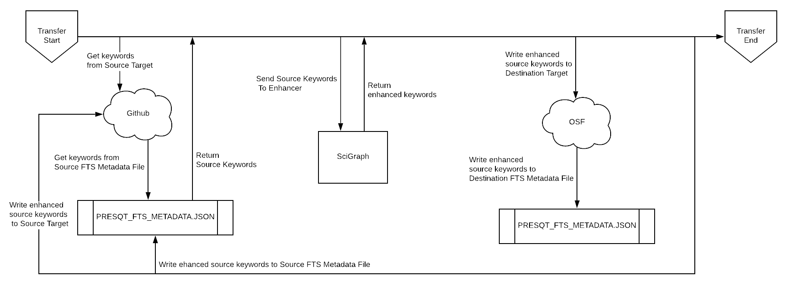
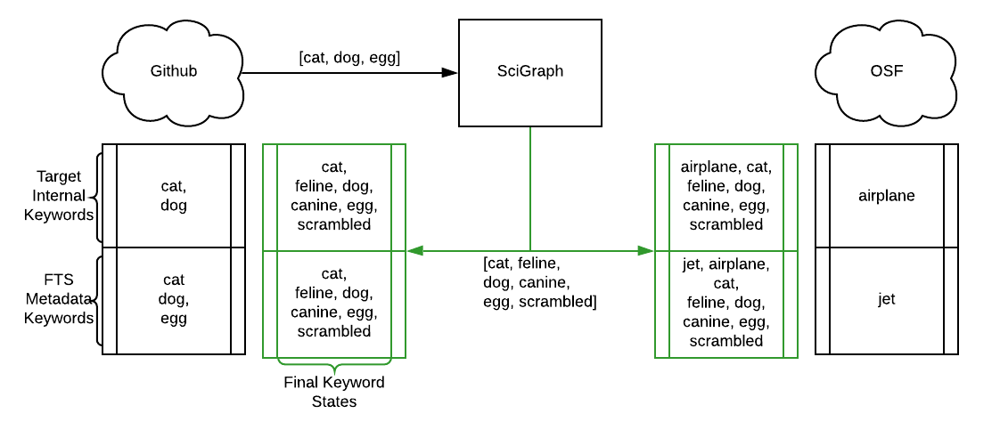
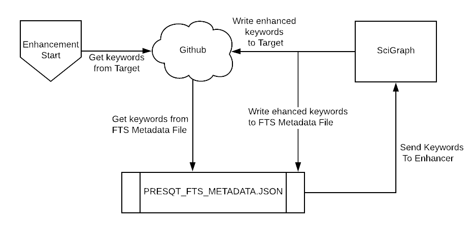
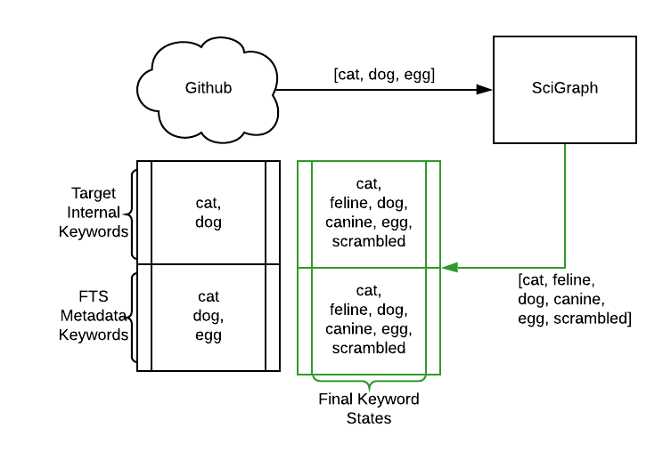

Web Services
============

Fixity
------

Tools
+++++

* Python Hashlib Library https://docs.python.org/3/library/hashlib.html
* BagIt Python Validation https://github.com/LibraryOfCongress/bagit-python#validation

PresQT Supported Hash Algorithms
++++++++++++++++++++++++++++++++

The following is a master list of hash algorithms that are both supported by a target and supported
by Python's HashLib library:

* sha256
* md5

Each individual target's supported hash algorithms can be found in presqt/specs/targets.json

Resource Download Fixity
++++++++++++++++++++++++

Fixity is checked during ``Resource Download`` by comparing the file hashes provided by the source target
with hashes that are generated after files are downloaded on to the server. If the provided hash and the
calculated hash match then fixity passes!

The download function will try and find a matching hash algorithm between the source target supported algorithms and
algorithms supported by the Python Hashlib library to use when generating hashes for files downloaded to the server.
If no hash algorithms match or if the source target does not provide file hashes then ``md5`` is uses as a default.
It also counts this situation as fixity passing since we didn't know what the original hash was.

**Valid Hashes Provided + Fixity Passes Example**:

.. code-block:: json

    {
        "sha256": "343e249fdb0818a58edcc64663e1eb116843b4e1c4e74790ff331628593c02be",
        "md5": "a4536efb47b26eaf509edfdaca442037"
    }

will yield

.. code-block:: json

    {
        "hash_algorithm": "sha256",
        "given_hash": "343e249fdb0818a58edcc64663e1eb116843b4e1c4e74790ff331628593c02be",
        "calculated_hash": "343e249fdb0818a58edcc64663e1eb116843b4e1c4e74790ff331628593c02be",
        "fixity": true
    }

**Valid Hashes Provided + Fixity Fails Example**:

.. code-block:: json

    {
        "sha256": "343e249fdb0818a58edcc64663e1eb116843b4e1c4e74790ff331628593c02be",
        "md5": "a4536efb47b26eaf509edfdaca442037"
    }

will yield

.. code-block:: json

    {
        "hash_algorithm": "sha256",
        "given_hash": "343e249fdb0818a58edcc64663e1eb116843b4e1c4e74790ff331628593c02be",
        "calculated_hash": "12345678",
        "fixity": false
    }

**Blank Hashes Provided Example**:

.. code-block:: json

    {
        "sha256": null,
        "md5": null
    }

will yield

.. code-block:: json

    {
        "hash_algorithm": "md5",
        "given_hash": null,
        "calculated_hash": "343e249fdb0818a58edcc64663e1eb116843b4e1c4e74790ff331628593c02be",
        "fixity": true
    }

**Unknown Hashes Provided Example**:

.. code-block:: json

    {
        "unknown_hasher": "12345",
        "special_hasher": "1234567"
    }

will yield

.. code-block:: json

    {
        "hash_algorithm": "md5",
        "given_hash": null,
        "calculated_hash": "343e249fdb0818a58edcc64663e1eb116843b4e1c4e74790ff331628593c02be",
        "fixity": true
    }

Resource Upload Fixity
++++++++++++++++++++++

During the resource upload process, fixity is checked in two locations. First, when files are saved
to the disk from the request. Second, after files are uploaded to the target.

.. figure::  images/upload_process/upload_fixity.png
   :align:   center

   Image 1: Where in the upload process fixity is checked

Fixity Check 1
""""""""""""""
Resources must be included in the POST request in BagIt format as a zip file. After unzipping the
file and saving it to the server we validate the bag using BagIt's built in validator. If any files
saved don't match the manifest originally given then the fixity has failed and the server will return
an error.

Generate New Hashes If Necessary
""""""""""""""""""""""""""""""""
We now know that the currently saved files are the same as what the user sent forward. Before uploading
resources to the target we will make sure that there is a dictionary of hashes available generated by a hash algorithm
supported by the target. If the target supports a hash algorithm provided by the resource's 'bag'
then we will simply use those. If not, then we need to generate new hashes based on a target supported
hash algorithm.

Fixity Check 2
""""""""""""""
After resources are uploaded to the target, we compare the resources' hashes brought back from the
target to the hashes we captured before. If any hashes don't match then fixity fails. Since the
resources have already been uploaded we simply capture which resources' fixity fails and pass that
along the response payload along with the message, 'Upload successful but fixity failed'.

Resource Transfer Fixity
++++++++++++++++++++++++

Since the ``Transfer`` endpoint takes advantage of the ``Download`` and ``Upload`` endpoints, fixity
is checked using all methods already existing in those endpoints.

File Transfer Service (FTS) Metadata
------------------------------------
PresQT keeps track of file history of resources being updated by PresQT by passing along an
FTS Metadata file with each PresQT action. The file is titled ``PRESQT_FTS_METADATA.json``.
Every time PresQT takes action on a resource, the source details about the files moved are written
to the metadata file.

**Definition of** ``PresQT FTS Metadata`` **fields**:

===================== ====== ==============================================================================
allEnhancedKeywords   array  All Keywords added to this resource via PresQT.
actions               array  Array of PresQT actions that have taken place on the this project
id                    string ID of the PresQT action (uuid4). Created at the time metadata is written
actionDateTime        string Date and time that the action took place
actionType            string Type of action (Download, Upload, Transfer)
sourceTargetName      string Name of the source target the action is taking place on
sourceUsername        string Requesting user’s source target username
destinationTargetName string Name of the destination target the action is taking place on
destinationUsername   string Requesting user’s destination target username
keywordEnhancements   dict   Keyword enhancements that took place during this action

                             `*` Fields found in this dictionaries

initialKeywords*      array  The initial keywords found in this target

                             This includes keywords in the target keywords found in FTS metadata file

enhancedKeywords*     array  The new keyword enhancements added to the target
enhancer*             str    The enhancement service used to enhance the keywords

files                 array  Array of files that were involved in the PresQT action
sourcePath            string Path of the file at the source target
sourceHashes          dict   Object that contains the file hashes at the source target
title                 string Title of the file at the source target
extra                 dict   Object that contains all extra metadata we can retrieve from the source target
failedFixityInfo      array  Array containing dictionaries of info on files that failed fixity check

                             `**` Fields found in this dictionaries

newGeneratedHash**    string PresQT generated hash of the file
algorithmUsed**       string Hash Algorithm used for the newGeneratedHash
reasonFixityFailed**  string Reason fixity failed for the file
destinationPath       string Path of the file at the destination target
destinationHashes     dict   Object that contains the file hashes at the destination target
===================== ====== ==============================================================================

**Example of** ``PresQT FTS Metadata`` **generated by a transfer of a project from GitHub to OSF**:

.. code-block:: json

    {
        "allEnhancedKeywords": ["cat", "dog", "feline", "doggo"],
        "actions": [
            {
                "id": "bc5a48dc-d1f9-46bd-9137-48fe4843df77",
                "actionDateTime": "2019-11-12 15:45:45.309566+00:00",
                "actionType": "resource_transfer_in",
                "sourceTargetName": "github",
                "sourceUsername": "github_username",
                "destinationTargetName": "osf",
                "destinationUsername": "osf_username",
                "keywordEnhancements": {
                    "initialKeywords": ["cat", "dog"],
                    "enhancedKeywords": ["feline", "doggo"],
                    "enhancer": "scigraph"
                },
                "files": {
                    "created": [
                        {
                            "destinationPath": "NewProject/osfstorage/funnyfunnyimages/Screen_Shot.png",
                            "destinationHashes": {
                                "md5": "3505a89c3cbb82873a107ae41f3997c3"
                            },
                            "failedFixityInfo": [
                                {
                                    "NewGeneratedHash": "3505a89c3cbb82873a107ae41f3997c3",
                                    "algorithmUsed": "md5",
                                    "reasonFixityFailed": "Either a Source Hash was not provided or the source hash algorithm is not supported."
                                }
                            ],
                            "title": "Screen_Shot.png",
                            "sourceHashes": {},
                            "sourcePath": "/NewProject/funnyfunnyimages/Screen_Shot.png",
                            "extra": {
                                "commit_hash": "211ef8db83612802aeea151a0e04badfe287bcb9",
                                "size": 731202,
                                "url": "https://api.github.com/repos/presqt-test-user/NewProject/contents/funnyfunnyimages/Screen_Shot.png?ref=master",
                                "html_url": "https://github.com/presqt-test-user/NewProject/blob/master/funnyfunnyimages/Screen_Shot.png",
                                "git_url": "https://api.github.com/repos/presqt-test-user/NewProject/git/blobs/211ef8db83612802aeea151a0e04badfe287bcb9",
                                "download_url": "https://raw.githubusercontent.com/presqt-test-user/NewProject/master/funnyfunnyimages/Screen_Shot.png",
                                "type": "file",
                                "_links": {
                                    "self": "https://api.github.com/repos/presqt-test-user/NewProject/contents/funnyfunnyimages/Screen_Shot.png?ref=master",
                                    "git": "https://api.github.com/repos/presqt-test-user/NewProject/git/blobs/211ef8db83612802aeea151a0e04badfe287bcb9",
                                    "html": "https://github.com/presqt-test-user/NewProject/blob/master/funnyfunnyimages/Screen_Shot.png"
                                }
                            }
                        }
                    ],
                    "updated": [],
                    "ignored": []
                }
            }
        ]
    }

**Now if we download from OSF the same project that was just transferred, then** ``PresQT FTS Metadata`` **would be**:

.. code-block:: json

    {
        "allEnhancedKeywords": ["cat", "dog", "feline", "doggo"],
        "actions": [
            {
                "id": "bc5a48dc-d1f9-46bd-9137-48fe4843df77",
                "actionDateTime": "2019-11-12 15:45:45.309566+00:00",
                "actionType": "resource_transfer_in",
                "sourceTargetName": "github",
                "sourceUsername": "github_username",
                "destinationTargetName": "osf",
                "destinationUsername": "osf_username",
                "keywordEnhancements": {
                    "initialKeywords": ["cat", "dog"],
                    "enhancedKeywords": ["feline", "doggo"],
                    "enhancer": "scigraph"
                },
                "files": {
                    "created": [
                        {
                            "destinationPath": "NewProject/osfstorage/funnyfunnyimages/Screen_Shot.png",
                            "destinationHashes": {
                                "md5": "3505a89c3cbb82873a107ae41f3997c3"
                            },
                            "failedFixityInfo": [
                                {
                                    "NewGeneratedHash": "3505a89c3cbb82873a107ae41f3997c3",
                                    "algorithmUsed": "md5",
                                    "reasonFixityFailed": "Either a Source Hash was not provided or the source hash algorithm is not supported."
                                }
                            ],
                            "title": "Screen_Shot.png",
                            "sourceHashes": {},
                            "sourcePath": "/NewProject/funnyfunnyimages/Screen_Shot",
                            "extra": {
                                "commit_hash": "211ef8db83612802aeea151a0e04badfe287bcb9",
                                "size": 731202,
                                "url": "https://api.github.com/repos/presqt-test-user/NewProject/contents/funnyfunnyimages/Screen_Shot.png?ref=master",
                                "html_url": "https://github.com/presqt-test-user/NewProject/blob/master/funnyfunnyimages/Screen_Shot.png",
                                "git_url": "https://api.github.com/repos/presqt-test-user/NewProject/git/blobs/211ef8db83612802aeea151a0e04badfe287bcb9",
                                "download_url": "https://raw.githubusercontent.com/presqt-test-user/NewProject/master/funnyfunnyimages/Screen_Shot.png",
                                "type": "file",
                                "_links": {
                                    "self": "https://api.github.com/repos/presqt-test-user/NewProject/contents/funnyfunnyimages/Screen_Shot.png?ref=master",
                                    "git": "https://api.github.com/repos/presqt-test-user/NewProject/git/blobs/211ef8db83612802aeea151a0e04badfe287bcb9",
                                    "html": "https://github.com/presqt-test-user/NewProject/blob/master/funnyfunnyimages/Screen_Shot.png"
                                }
                            }
                        }
                    ],
                    "updated": [],
                    "ignored": []
                }
            },
            {
                "id": "bc5a48dc-d1f9-46bd-9137-48fe4843df77",
                "actionDateTime": "2019-11-12 15:45:45.309566+00:00",
                "actionType": "resource_download",
                "sourceTargetName": "osf",
                "sourceUsername": "osf_username",
                "destinationTargetName": "Local Machine",
                "destinationUsername": null,
                "keywordEnhancements": {},
                "files": {
                    "created": [
                        {
                            "destinationPath": "/NewProject/osfstorage/funnyfunnyimages/Screen_Shot.png",
                            "destinationHashes": {},
                            "failedFixityInfo": [],
                            "title": "Screen_Shot.png",
                            "sourceHashes": {
                                "sha256": "6d33275234b28d77348e4e1049f58b95a485a7a441684a9eb9175d01c7f141ea",
                                "md5": "3505a89c3cbb82873a107ae41f3997c3"
                            },
                            "sourcePath": "/NewProject/osfstorage/funnyfunnyimages/Screen_Shot.png",
                            "extra": {
                                "id": "5dcc215848a1d9000cd0a3fb",
                                "parent_project_id": "2bw9j",
                                "endpoint": "https://api.osf.io/v2/files/5dcc215848a1d9000cd0a3fb/",
                                "download_url": "https://files.osf.io/v2/resources/2bw9j/providers/osfstorage/5dcc215848a1d9000cd0a3fb",
                                "upload_url": "https://files.osf.io/v2/resources/2bw9j/providers/osfstorage/5dcc215848a1d9000cd0a3fb",
                                "delete_url": "https://files.osf.io/v2/resources/2bw9j/providers/osfstorage/5dcc215848a1d9000cd0a3fb",
                                "last_touched": null,
                                "date_modified": "2019-11-13T15:29:29.043502Z",
                                "current_version": 1,
                                "date_created": "2019-11-13T15:29:29.043502Z",
                                "provider": "osfstorage",
                                "path": "/5dcc215848a1d9000cd0a3fb",
                                "current_user_can_comment": true,
                                "guid": null,
                                "checkout": null,
                                "tags": [],
                                "size": 731202
                            }
                        }
                    ],
                    "updated": [],
                    "ignored": []
                }
            }
        ]
    }

Metadata Location When Downloading
++++++++++++++++++++++++++++++++++

The ``PresQT FTS Metadata`` file will be written to the highest level possible of the resource
being downloaded.

Metadata Location When Uploading or Transferring
++++++++++++++++++++++++++++++++++++++++++++++++

The ``PresQT FTS Metadata`` file will be written to the highest level possible of the destination project.
Since this possible level may vary for any target, we leave it up to the target to handle this
when they integrate with Upload.

Existing Metadata
+++++++++++++++++

If a valid ``PresQT FTS Metadata`` file is found at the top level of the resource being affected by
the action then we will add a new action to this existing metadata file.

If an invalid ``PresQT FTS Metadata`` file is found at the top level of the resource being affected
by the action then we will rename the invalid metadata file to ``INVALID_PRESQT_FTS_METADATA.json`` and
then we will create a new valid metadata file with the current actions metadata.

Keyword Assignment
------------------

Keyword Enhancers
+++++++++++++++++

* SciGraph http://ec-scigraph.sdsc.edu:9000/scigraph/docs/

Keyword Difference Between Targets
++++++++++++++++++++++++++++++++++

Each target holds keywords in different attributes. Some may have keywords in multiple attributes.
The following table outlines the keyword attributes for each target.

=========== ======================
**Targets** **Keyword Attributes**
OSF         [Tags]
Github      [Topics]
Gitlab      [Tag List]
CurateND    [Subjects]
Zenodo      [Keywords]
=========== ======================

Keyword Assignment During Transfer
++++++++++++++++++++++++++++++++++
When transferring a resource you have the option to either enhance keywords or suggest keyword
enhancements by adding ``presqt-keyword-action`` to the request headers. The options are ``suggest``
or ``enhance``.

Suggest Keywords
""""""""""""""""
If ``presqt-keyword-action`` is ``suggest`` then PresQT will take no actions on your behalf regarding
keywords during the transfer. It will still gather keywords from the target and from the FTS metadata
file found for the resource being transferred and enhance them with the given keyword enhancer
(for now it defaults to SciGraph). The suggested enhancements will be returned in the ``Transfer Job``
response once the transfer finishes.

Enhance Keywords
""""""""""""""""
If ``presqt-keyword-action`` is ``enhance`` then PresQT will take several actions regarding keyword
enhancements during the transfer process.

1. Fetch all source keywords both in the target and in the FTS metadata file for the transferred resource.

2. Get enhancements with the given enhancer (Defaults to SciGraph for now).

3. Upload keyword enhancements to the ``Source Target`` and ``Destination Target``.

4. Add the keyword enhancements to the FTS Metadata file that gets written to the ``Destination Target`` during the transfer.

5. Add the keyword enhancements to the FTS Metadata file that gets written to the ``Source Target`` during the transfer.

   Image 2: Lifecycle of Keyword Enhancement during a transfer

   Image 3: Practical Example of Keyword Enhancement during a transfer

Keyword Assignment Service Endpoint
+++++++++++++++++++++++++++++++++++

Keyword Enhancement can be done without transferring.

1. Use the ``Keyword Enhancement GET`` endpoint to fetch the keywords from the resource.

2. Pass the keywords you want to enhance to the ``Keyword Enhancement POST`` endpoint.

3. Enhanced keywords will get uploaded to the target and a new action will get written to the FTS metadata file.

   Image 4: Lifecycle of a Keyword Enhancement Service

   Image 5: Practical Example of a Keywords Enhancement Service

Preservation Quality
--------------------
IN PROGRESS

