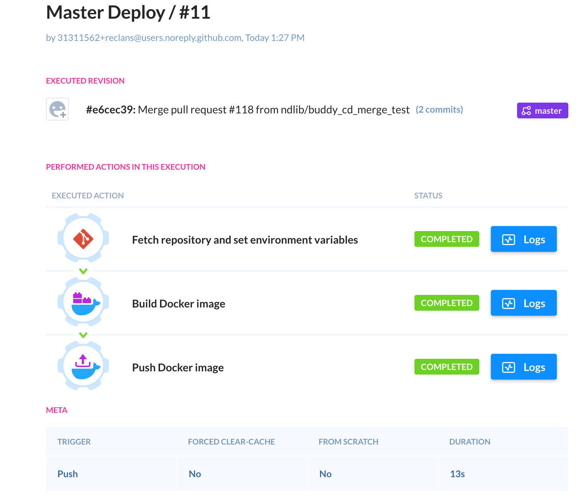

Tools/Services
==============

BitCurator
----------

BitCurator Evaluation
+++++++++++++++++++++
Initial review of BC from website. From `BC wiki <https://confluence.educopia.org/display/BC/BitCurator+Environment />`_:

    .. note::
        
        The BitCurator Environment is a Ubuntu-derived Linux distribution geared
        towards the needs of archivists and librarians. It includes a suite of open
        source digital forensics and data analysis tools to help collecting
        institutions process born-digital materials. BitCurator supports positive
        digital preservation outcomes using software (see our Tasks and Tools page)
        and practices adopted from the digital forensics community.
        In the BitCurator Environment you can:
        Create forensic disk images: Disk images packaged with metadata about devices, file systems, and the creation process.
        Analyze files and file systems: View details on file system contents from a wide variety of file systems.
        Extract file system metadata: File system metadata is a critical link in the chain of custody and in records of provenance.
        Identify sensitive information: Locate private and sensitive information on digital media and prepare materials for access.
        Locate and remove duplicate files: Know what files to keep and what can be discarded.

BC runs in its own virtual machine. It packages many other tools together. It also has some 
custom-developed tools.

Custom Developed Tools
++++++++++++++++++++++
* *BitCurator Reporting Tool* A GUI-driven (and optionally command-line) tool for running forensics tools in sequence to produce human- and machine-readable reports.
* *BitCurator Disk Image Access Tool* A GUI interface to browse raw and forensically-packaged disk images, export files and deleted items, and view disk image metadata.
* *BitCurator Mounter* A Qt GUI application to list currently attached devices along with technical details. Allows users to mount fixed and removable media according to the current mount policy.
* *BitCurator Read-Only AppIndicator* A Ubuntu AppIndicator allowing users to switch the system mount policy between "Read Only" and "Read/Write" for any attached media prior to mounting.
* *Nautilus scripts* Support for various interactions with files and file systems.
* *Safe Mount Software* write-blocking for digital media.

Packaged External Tools
+++++++++++++++++++++++
These are tools that are not developed by the BitCurator Consortium itself, but are included in the 
BC distribution.

**Disk Imaging**

* Guymager: Multi-threaded open-source forensic disk imaging tool.
* dcfldd: A forensics-focused rewrite of dd.
* dd: Create raw disk images and transfer data between devices.
* ddrescue: A version of dd with additional options for data recovery.
* ewfacquire: Acquire Expert Witness packaged disk images from devices on the command line.
* cdrdao: CD imaging tool (primarily for audio CDs).

**Forensic Analysis**

* bulk_extractor: A stream-based tool for disk image analysis.
* bulk_extractor Viewer (BEViewer): The GUI front-end for bulk-extractor
* DFXML tools: A set of C and Python programs to process Digital Forensics XML.
* fiwalk: File system analysis and DFXML export.
* The Sleuth Kit: A suite of forensics tools, utilities, and APIs.
* libewf: Open-source support for the Expert Witness format.
* AFFLIB: Open-source library for the Advanced Forensic Format.
* pyExifToolGUI: A GUI front-end for Exiftool. Allows editing of image metadata.
* sdhash: File similarity tool using similarity digests.
* ssdeep: Fast hash generation.

**Other Tools**

* ClamAV / ClamTK: Virus scanning.
* FSlint: Duplicate file identification and deletion.
* HFS Utilities: Utilities providing access to legacy HFS file systems, such as HFS Explorer.
* readpst: A utility for reading and exporting the contents of PST files.
* GTK Hash: A cryptographic hashing tool.
* GHex: A hex viewer/editor

Thoughts
++++++++
It appears BC is intended to be used by humans. It is unclear how many of the custom developed 
interfaces can be interacted with programmatically, especially if the distribution is made to run in 
a VM (not sure whether this is for security or because most of these tools are linux based, and BC 
wants to work on Windows). However, many of its tools may be reusable, and may have command-line forms 
that would facilitate automation. (comment from BC wiki: "The virtual machine version of BitCurator 
is useful for testing and experimentation, but it is recommended that you run BitCurator on a 
dedicated machine in production environments by installing from the Live ISO image.")

It does appear like they have done a good job of curating such tools, so if any kind of file analysis 
functionality is needed, it would be useful to look here for any suggestions.

That said, some standard digital library tools for file identification are not listed, e.g. DROID, 
file, FITS, PRONOM.

MetaDIG
-------

Initial Evaluation
++++++++++++++++++
The goal is to review MetaDIG based on existing quality reports and XML checks to determine if parts 
of it can be adopted for PresQT.

**NCEAS/metadig-engine**

Java engine that does metadata quality checks.
Each check is given in a rule file using a custom xml format.
The checks specify pieces of the metadata to look at (using an xpath selector), and has an algorithm to execute with the selected data to return either "SUCCESS" or "FAILURE". The algorithms can be given in R, Java, or python.
A check can also return messages about what it found or as warnings.
Each check has metadata for:

* an identifier for the check
* a name for the check
* a plain text description of the check
* a "type" (not sure what possible types are)
* a level (INFO, OPTIONAL, REQUIRED)

The engine has a way to distribute and run jobs over many VMs.
It has been adapted it to run on Kubernetes.
There are many components to the system: Metadig-controller, Metadig-engine-core, Metadig-report-worker, Metadig-index-worker
(https://github.com/NCEAS/metadig-engine/blob/master/docs/Architecture.md#metadig-system-components)

**Observations**

* the checks are specifically for the metadata standards NCEAS uses: EML and ISO-19150
* b/c of the specificity of the xpaths, the checks would need to be adapted to support other metadata standards.
* the individual checks do not care about the xml format of the data, except for the need for xpath selectors
* non-xml structured metadata (e.g. in JSON) could converted to a parallel form in xml.
* checks only return "SUCCESS" or "FAILURE" as a status code. Checks do not support changing/adding/updating the metadata records.
* While most checks are written in R, python is supported (e.g. see check /src/main/resources/checks/check-keywordPresent.xml )
* checks can make web calls or import other packages

**Open Questions**

* Is it possible to deploy without using Kubernetes?

**Thoughts**

* How much throughput does PresQT need for analyzing metadata records? The parallel approach may not be necessary. But if it is, metadig already has the processing infrastructure built-out.
* If altering/enriching records is desired at some point, it might be more strategic to implement a similar engine that supports that functionality.
* metadig is based on a centralized model. PresQT needs to determine whether that fits its use cases.

**Conclusion**
After a group discussion we decided that we would not pursue Metadig for the moment because it does 
not have a way to enrich metadata. Also, right now we are not sure about the amount of distributed/consolidated 
architecture of the PresQT metadata.

Resources
+++++++++

* `Presentation slides <https://osf.io/vyfsz/ />`_ from the Partner Meeting in January 2019
* `Video presentation <https://osf.io/craqt/ />`_
* GitHub
    * `MetaDIG <https://github.com/NCEAS/metadig />`_
    * `MetaDIG Engine <https://github.com/NCEAS/metadig-engine />`_

osfclient
---------

osfclient Evaluation
++++++++++++++++++++

**Purpose**

Evaluate osfclient for adaptation into PresQT. ‘We’ in this document means The Center for Research 
Computing at The University of Notre Dame.

**Python Library**

* The Python Library is definitely useful for navigating the OSF API.
    * Possibly useful for writing files to OSF and downloading files from OSF.
* It currently uses Username/Password to login.
    * This can be updated to use tokens which we prefer.
        * This change should be relatively straight forward.
* There is the possibility that there are significant additions/changes that need to be added to the codebase to adapt it to PresQT.

**Command Line Interface**

The CLI functionality of OSFClient can not be taken advantage of for PresQT. PresQT does not offer a 
command line for the CRC to use any of the functions. Of course, the CRC can borrow code and methodologies.

**Questions/Concerns**

* Is anyone managing osfclient?
    * Will the process of making pull requests be lengthy/tedious/difficult?
    * Will it be easier to for a local copy and the osfclient can review our changes and decide what they want to adopt later?
    * Will we be in charge of writing documentation for changes we make? Will osfclient owners do this?
* If later on this adaptation doesn’t work then we would need to write our own functionality and this could set us back weeks/months.
* osfclient does not provide data in the format that we want it. And ultimately this format is non-negotiable since our PresQT API payloads need to be static to play well with other vendors.
    * We can write functions that transform it to suit out API payload desires but we’d rather write the original functions to return what we need.

**Conclusion**

* We will pull code from osfclient as a basis for our OSF integration into PresQT.
* We don’t feel that contributing to osfclient is feasible while meeting the current project demands.
* We also won’t be forking the osf integration because the end result might not look much like the original osfclient project so there is no need.
* However osfclient has given us a wonderful starting place and will be extremely useful in our integration of OSF to PresQT.

Continuous Integration
----------------------

Buddy CI
++++++++
The CI process for Buddy is set up so that all branches (except Master) will run a CI check on a g
ithub push command to determine if there are any errors with new branch content.  

Buddy and Github will interact with each other once a push is made to Github.  When a branch is 
pushed to Github, Buddy will get the new code, build docker image and execute Django manage.py command. 
This is done to determine if Docker contianers can be built, code runs and all unit tests pass.  
If a push succeeds or fails this information will made available in both Buddy and Github. 

This Buddy check does not occur when a pull request is made or two branches are merged.  However, 
before a branch reaches Github it will go through the Buddy CI check and the results are available 
in both Buddy and Github.  If a branch does not pass the checks the way PresQT has Github setup, 
Github will not allow it to be merged to another branch.

   Buddy success image

Github will display a green checkmark if the push attempt passed with Buddy.  If the process fails 
there will be a red X, and if the process is still running, an orange circle will be displayed.

.. figure::  images/continuous_integration/continuous_integration2.png
   :align:   center

   Github success image

Continuous Deployment
---------------------

Buddy CD
++++++++
The CD process for Buddy is set up so that it will build docker images and push these images to 
Docker Hub on a github push/merge command to the Master branch.  Unit tests are not run at this time.  
Git has been set up so that the master branch cannot be pushed to directly or be merged to without 
an approved pull request.

Buddy and Github will interact with each other if a push or merge is made to Master Branch. If a 
push/merge succeeds or fails this information will made available in both Buddy and Github.

   Buddy success image

Github will display a green check mark if the push attempt passed with Buddy. If the process fails 
there will be a red X, and if the process is still running, an orange circle will be displayed.

   GitHub success image

**Docker Hub**

link to docker images - https://hub.docker.com/r/presqt/presqt

Docker images can be loaded via Docker command

    ``docker pull presqt/presqt``

.. toctree::
   :maxdepth: 3
